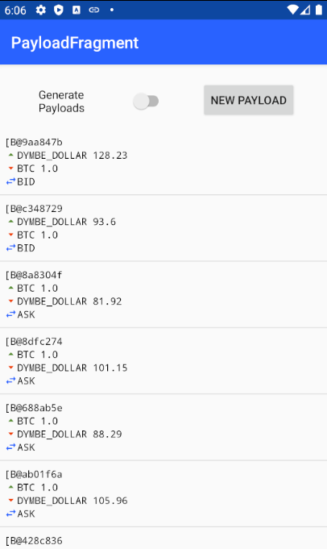

# TrustChain Super App [](https://github.com/Tribler/trustchain-superapp/actions)

This repository contains a collection of Android apps built on top of [IPv8](https://github.com/MattSkala/kotlin-ipv8) (our P2P networking stack) and [TrustChain](https://github.com/Tribler/kotlin-ipv8/blob/master/doc/TrustChainCommunity.md) (a scalable, distributed, pair-wise ledger). All applications are built into a single APK, following the concept of [super apps](https://home.kpmg/xx/en/home/insights/2019/06/super-app-or-super-disruption.html) – an emerging trend that allows to provide an ecosystem for multiple services within a single all-in-one app experience.

## Apps

### TrustChain Explorer

**TrustChain Explorer** allows to browse the TrustChain blocks stored locally on the device and crawl chains of other connected peers. It also demonstrates how to interact with `TrustChainCommunity`. It defines its own `DemoCommunity` to ensure that all users using the app are able to discover each other easily. The content of the app is split into several tabs:

- **Peers:** A list of discovered peers in `DemoCommunity`. For each peer, there is a time since the last sent and received message, and an average ping latency. After clicking on the peer item, a list of mutual blocks in TrustChain is shown. It is possible to create and send a new proposal block by clicking on the plus icon. A crawl request send be sent by clicking on the refresh button.
- **Chains:** A list of discovered chains in `TrustChainCommunity`, ordered by their length. After clicking on the item, the list of stored blocks is shown.
- **All Blocks:** A stream of all received blocks, updated in real-time as new blocks are received from the network.
- **My Chain:** A list of blocks in which the current user is participating either as a sender or a receiver. It is possible to create a new self-signed block by clicking on the plus icon. It is posible to sign received blocks if they are not defined to be signed automatically.

 

### Debug

**Debug** shows various information related to connectivity, including:

- The list of bootstrap servers and their health. The server is considered to be alive if we received a response from it within the last 120 seconds.
- The number of connected peers in the loaded overlays.
- The LAN address estimated from the network interface and the WAN address estimated from the packets received from peers outside of our LAN.
- The public key and member ID (SHA-1 hash of the public key)
- TrustChain statistics (the number of stored blocks and the length of our own chain)


### AI trading bot

**AI trading bot** consist of two parts.
1. An AI trading bot using a Naive Bayes Classifier which buys or sells Bitcoins in a decentralized market.
2. Sending and receiving money to and from other peers.

**Trading**
The AI trading bot app is visible upon opening the superapp. It receives bids and asks from other peers that want to buy or sell Bitcoins for Dymbe Dollars.
Upon receiving a bid or ask, it decides to either execute the offer or not.
The bot can be toggled on and off using the toggle on the home screen.

**Send/Receive**
In the sending/receiving money tab one can send money to, or receive money from a different peer.
There are two ways to find a public key:
1. The receiving peer presses the send/receive toggle. His public key will be shown as a QR-code. Now pressing the "scan" button on the sender's device allows you can scan the QR code of the receiver.
2. As a sender, go to the "Peers" fragment in the app, and press the public key of the receiver.

<br />
[More about AI trading bot](trustchain-trader/readme.md)

### Market Bot

The market bot app can generate bids and asks which are received by the peers in the market community.
The bid and asks can either be generated automatically or manually. Those bids and asks will be sent as IPv8 messages.

<br />
[More about Market Bot](trustchain-payloadgenerator/readme.md)

### TrustChain Voter
The TrustChain Voter can be used to create a proposal on which the community can vote. The functionality has been split up in two parts: a Voting API, which provides the core voting functionality, and a TrustChain Voter submodule, which serves to demonstrate the capabilities of the voting API. Below, the process of creating a proposal (left) and casting a vote (right) can be seen.

- [More about the Voting API](common/README.md#votinghelper)
- [More about the TrustChain Voter submodule](trustchain-voter/README.md)

  

### Do you want to add your own app?

- [Adding your own app to the TrustChain Super App](doc/AppTutorial.md)

## Build

If you want to build an APK, run the following command:

```
./gradlew :app:buildDebug
```

The resulting APK will be stored in `app/build/outputs/apk/debug/app-debug.apk`.

## Install

You can also build and automatically install the app on all connected Android devices with a single command:

```
./gradlew :app:installDebug
```

*Note: It is required to have an Android device connected with USB debugging enabled before running this command.*

## Tests

Run unit tests:
```
./gradlew test
```

Run instrumented tests:
```
./gradlew connectedAndroidTest
```

## Code style

[Ktlint](https://ktlint.github.io/) is used to enforce a consistent code style across the whole project.

Check code style:
```
./gradlew ktlintCheck
```

Run code formatter:
```
./gradlew ktlintFormat
```
