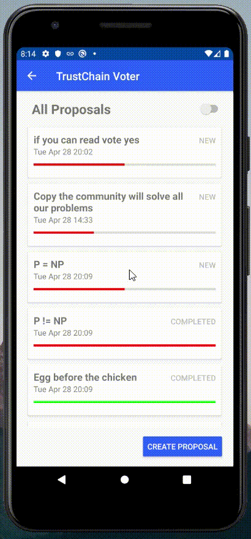
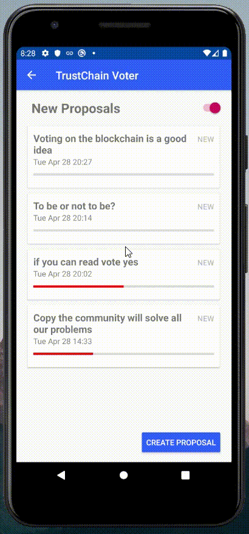
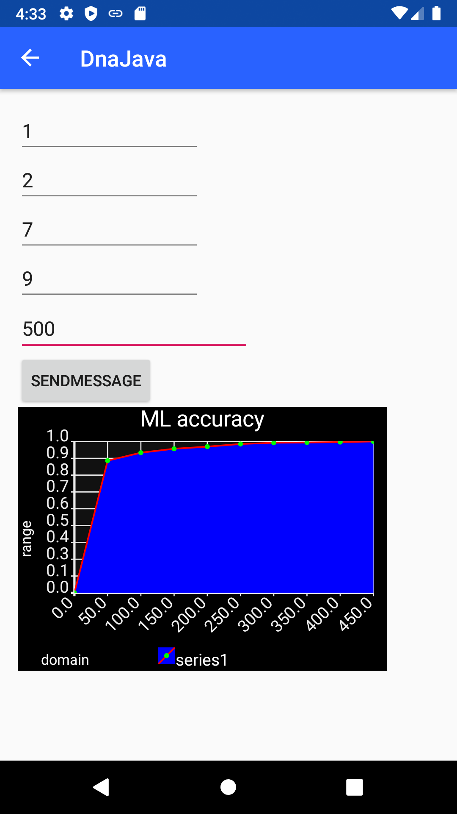
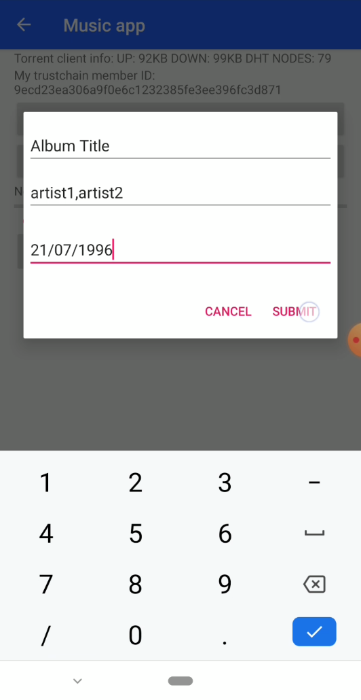
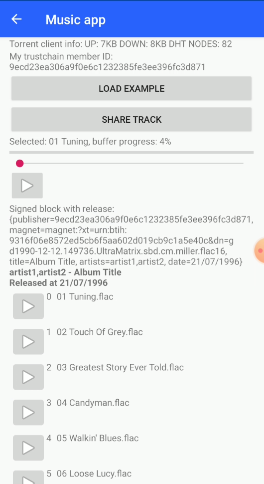
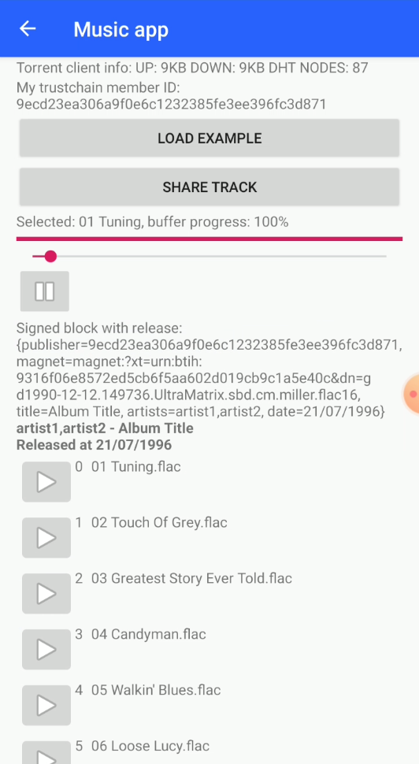
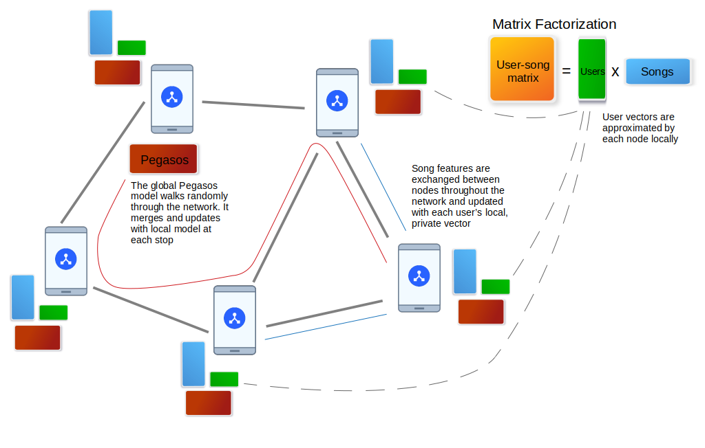

# TrustChain Super App [](https://github.com/Tribler/trustchain-superapp/actions)

This repository contains a collection of Android apps built on top of [IPv8](https://github.com/MattSkala/kotlin-ipv8) (our P2P networking stack) and [TrustChain](https://github.com/Tribler/kotlin-ipv8/blob/master/doc/TrustChainCommunity.md) (a scalable, distributed, pair-wise ledger). All applications are built into a single APK, following the concept of [super apps](https://home.kpmg/xx/en/home/insights/2019/06/super-app-or-super-disruption.html) – an emerging trend that allows to provide an ecosystem for multiple services within a single all-in-one app experience.

## Apps

### TrustChain Explorer

**TrustChain Explorer** allows to browse the TrustChain blocks stored locally on the device and crawl chains of other connected peers. It also demonstrates how to interact with `TrustChainCommunity`. It defines its own `DemoCommunity` to ensure that all users using the app are able to discover each other easily. The content of the app is split into several tabs:

- **Peers:** A list of discovered peers in `DemoCommunity`. For each peer, there is a time since the last sent and received message, and an average ping latency. After clicking on the peer item, a list of mutual blocks in TrustChain is shown. It is possible to create and send a new proposal block by clicking on the plus icon. A crawl request send be sent by clicking on the refresh button.
- **Chains:** A list of discovered chains in `TrustChainCommunity`, ordered by their length. After clicking on the item, the list of stored blocks is shown.
- **All Blocks:** A stream of all received blocks, updated in real-time as new blocks are received from the network.
- **My Chain:** A list of blocks in which the current user is participating either as a sender or a receiver. It is possible to create a new self-signed block by clicking on the plus icon. It is posible to sign received blocks if they are not defined to be signed automatically.

 

### PeerChat

PeerChat implements a fully functional prototype of a distributed messaging app. First, the users have to exchange the public keys by scanning each other's QR code, or by copy-pasting the hexadecimal public keys. This guarantees authenticity of all messages which are signed by their author. It prevents man-in-the-middle and impersonation attacks.

An online indicator and the last message is shown for each contact. Users can exchange text messages and get acknowledgments when a message is delivered.

  

  

### DeToks
**Decentralised TikTok** skeleton app for the CS4160 Blockchain Engineering (2022/23) course.
# Detoks - Offline Token 2
An offline payment application that makes sending and receiving tokens easily.
A user can choose the amount to be received and create a request which can be paid by a preadded contact.
The payment can then be done by scanning the generated QR code and a transaction is then made.
A Eurotoken is minted and verified by a central authority.


APK - https://drive.google.com/file/d/1r2p7AvBQ-pumPTApD-cKcR0m7v0g8q1D/view?usp=share_link

### Use case
The application can be used for the following use cases:

**1. Create and store EuroToken**

Creating eurotokens can be performed currently from both the wallet page and admin page by first specifying
the value of the token and then pressing the "Create new coin" button. The new token can then be seen on the screen.


**2. Send and receive EuroToken between contacts** (by encoding and creating QR for EuroToken)

To send money, you need to press the "Send" button on the screen with the video.
After that, the recipient of the token and positive amount needs to be specified.
If the balance is enough and the specified amount could be created exactly then the QR code is displayed and the receiver can scan it by clicking on the "Scan" button.

  **1. Send Money**

  

  **2. Receive Money**

  


**3. Add new contact**

To add a new contact, first press on the "Send" button on the top right of the screen with the displayed video. After that to navigate to the contact page, press on the top right the button "Add Friend". You should now see a screen with two big buttons "Show My Public Key" and "Scan Recipient's Key" the QR code that encodes the public key is shown. Depending on whether you want to add a contact or another user wants to save your contact you should press on one of the buttons.

Pressing on "Show My Public Key" a QR code that encodes your public key is shown.
"Scan Recipient's Key" triggers the scanner and the QR code of the new contact can be scanned.
After that the name should be specified and pressing "Save" will save the new entry.


### Double spending
To mitigate double spending, contacts are to be added before users can send or receive EuroTokens.
This makes it easier for admins to track double-spend EuroToken and give users warnings when trying to add malicious users.
Another important concept is used to make sure that the detection of double spending is relatively on time.
After receiving a new token, the token is valid for a limited amount of time (a month).
After that month a token must be verified before being able to re-spend it. The token will be restamped with a new timestamp which makes it a valid euro token.

### Preventing Double Spending

We prevent the same QR Code to be scanned by two different people, thereby preventing Double Spending. This is achieved with the concept of maintaining an addressbook. An addressbook keeps a list of recipients and their corresponding Public Key. In order to send money, the recipient needs to be added to the sender's addressbook.

- More Details
Before sending the token, the public key of the receiver is encoded in the recipients of the token.
Once the token is scanned, prior to adding it to the wallet, the public key of the receiver and the encoded public key of the recipient are compared.
In case they match, the transaction is successful, otherwise, a message for the user is displayed - "This token is not for you!".
Since the public key is unique, this token has a unique receiver.


### QR codes explanation
#### Contact QR Code:
In order to be able to send tokens, first the receiver contact needs to be saved as a friend. This could be performed by pressing the button "Add Friend" and then "Show My Public Key" and the QR code that encodes the public key is shown. The sender of the money can then scan it and save it as a contact for later use.
First, the public key is serialized to a JSON object and then it is encoded to bitmap and the QR code is created and shown on the screen of the user.


#### Token QR Code:
This QR code is shown once a positive amount less or equal to the balance of the user is specified and the receiver is also chosen from the dropdown menu.
The QR code contains all tokens whose value sums exactly to the specified amount by the user. In case the specified amount can not be formed by the existent tokens then the following message is shown to the user - "Not Successful (not enough money or could get amount)". In case however, the amount can be made by the existing tokens, then those tokens are first serialized to JSON objects, then compressed and the compression is encoded as a bitmap and displayed to the user.
After this, a message -"Successful " with the new balance is shown.


### Limitations
1. Even though we compress and uncompress the QR code, the QR code gets very cluttered while encoding large number of tokens and makes it difficult for the recipient receiving money to scan the QR Code.
2. Cannot do more transactions due to the limited size of QR Code.

### Future work
To detect the double spending, two ideas were discussed which can be implemented in the future:
1. Using the verifivation mechanism, double spending can be easily detected when two users try to verify the same token. The authority will be able to direcly detect the double spender.
2. To prevent double spending in offline transactions, a given precentage of the user tokens is preserved and cannot be used to make payments until the user comes online.

### Digital Euro

The Superapp is connected to the European IBAN Euro system.
You can send and receive digital Euros using QR-codes or build-in chat. **Experimental**.
Sending Euros is as easy as sending a smiley.
We did a test with native implementation of Trustchain and [a digital Euro last week](https://twitter.com/TriblerTeam/status/1367526077422256128).
Field test date: 4 March 2021 at 10:30am.
The native Android implementation in Kotlin is slowly getting mature.
Location: the bar Doerak (with a liquor license! This is a special place, therefore selected as the site for our trail.
Shops which sell coffee or closed canisters of alcohol are "essential shops" and therefore open in Corona times.) Loading real money on your phone requires an operational an open source [gateway](https://github.com/rwblokzijl/stablecoin-exchange) of Euros to digital Euros.
Discussed in this master thesis issue: https://github.com/Tribler/tribler/issues/4629

#### Double Spending mitigation
Double spending in EuroToken occurs when a malicious user sends a transaction to a wallet, and then sends the same transaction to another wallet whilst the second receiver is not aware of the first transaction.
This has been mitigated by introducing a web-of-trust, read more about this in the [EuroToken README.MD](eurotoken/README.MD)

Creative Commons CC0 license - share freely:


Zooming into the actual mechanism of QR-Codes (Creative Commons CC0 license - share freely)


### Debug

**Debug** shows various information related to connectivity, including:

- The list of bootstrap servers and their health. The server is considered to be alive if we received a response from it within the last 120 seconds.
- The number of connected peers in the loaded overlays.
- The LAN address estimated from the network interface and the WAN address estimated from the packets received from peers outside of our LAN.
- The public key and member ID (SHA-1 hash of the public key)
- TrustChain statistics (the number of stored blocks and the length of our own chain)


### AI trading bot
The AI trading bot is a zero-server AI, which ultimately can understand markets, limit orderbooks, bid/ask pairs and global stock patterns using only smartphones for computing power and connection.
Built on top of Trustchain, the app provides a small decentralized market for trading, providing safe and verifiable transaction for any arbitrary change of goods.

**AI trading bot** consist of two parts.
1. An AI trading bot using a Naive Bayes Classifier which buys or sells Bitcoins in a decentralized market.
2. Sending and receiving money to and from other peers.

**Trading**
The AI trading bot app is visible upon opening the superapp. It receives bids and asks from other peers that want to buy or sell Bitcoins for Dymbe Dollars.
Upon receiving a bid or ask, it decides to either execute the offer or not.
The bot can be toggled on and off using the toggle on the home screen.

**Send/Receive**
In the sending/receiving money tab one can send money to, or receive money from a different peer.
There are two ways to find a public key:
1. The receiving peer presses the send/receive toggle. His public key will be shown as a QR-code. Now pressing the "scan" button on the sender's device allows you can scan the QR code of the receiver.
2. As a sender, go to the "Peers" fragment in the app, and press the public key of the receiver.

<br />
[More about AI trading bot](trustchain-trader/readme.md)

### Market Bot

The market bot app can generate bids and asks which are received by the peers in the market community.
The bid and asks can either be generated automatically or manually. Those bids and asks will be sent as IPv8 messages.

<br />
[More about Market Bot](trustchain-payloadgenerator/readme.md)

### Luxury Socialism
{_recent events have turned this into_ **really bad naming**} We build a DAO for a better world. Luxury socialism is an Android application built on top of [IPv8](https://github.com/Tribler/kotlin-ipv8) and [Trustchain](https://github.com/Tribler/kotlin-ipv8/blob/master/doc/TrustChainCommunity.md), and is integrated into the [Trustchain Superapp](https://github.com/Tribler/trustchain-superapp). It is a proof-of-concept implementation of a DAO system using Trustchain and Bitcoin. Trustchain is used for communication and bookkeeping while the Bitcoin blockchain is used to have collective multi-signature wallets for each DAO. The content of the app is split up in several tabs:
* **First Time Launch**: The first time the app is launched, the user must setup his bitcoin wallet. Afterwhich the chain will sync and he is routed to the main screens.
* **My DAO's**: A list of all DAO's that the user participates in. Selecting a DAO will allow a user to create a transfer proposal from that DAO.
* **All DAO's**: A list of all discovered DAO's in the network which the user can propose to join.
* **Proposals**: A list of all proposals that the user can vote on. This can either be join proposals or proposals from someone else to transfer funds from one of the DAO's.
* **My Wallet**: Overview of the used Bitcoin wallet and the ability to chain this to another.
* **Duplicate Wallet**: In case the user has wallet files for TestNet, Production or Regtest, the user is allowed to select which one to keep. After the user selected either one, the files belonging to other network type are backed up. This, thus, ensures that the wallet is not lost.

Currently, the Luxury Socialism app only allows Regtest, since it uses a future update of Bitcoin called Taproot. Once Taproot is officially released, the app can support TestNet or Production again. Taproot allows the DAO to scale to thousands or even millions of users. The beauty of Taproot is that it uses Schnorr signatures for each transaction. This enables transaction sizes that are equal independent of the number of users in a DAO, since each user combines their signature collaberatively into one for the whole DAO. This also ensures privacy, since it is no longer possible to tell if a transaction's is from a single person, or a million of persons.

  
<br />

<p float="left">


</p>
<br />

https://user-images.githubusercontent.com/23526224/116259903-85efd900-a776-11eb-93b1-384936d215c4.mp4


[More about Luxury Socialism](currencyii/README.md)

### TrustChain Voter
The TrustChain Voter can be used to create a proposal on which the community can vote. The functionality has been split up in two parts: a Voting API, which provides the core voting functionality, and a TrustChain Voter submodule, which serves to demonstrate the capabilities of the voting API. Below, the process of creating a proposal (left) and casting a vote (right) can be seen.

- [More about the Voting API](common/README.md#votinghelper)
- [More about the TrustChain Voter submodule](trustchain-voter/README.md)

 

### Freedom-of-Computing App

Freedom-of-Computing provides users with the ability to freely distribute and execute code in the form of APK applications on the trustchain superapp. In order to facilitate the sharing of applications, Freedom-of-Computing contains a gossiping mechanism which periodically shares local applications to other users and downloads unseen applications from other users. This sharing is conducted through a torrent peer-to-peer (P2P) network and uses the EVA Protocol as a fallback. Once the application has been downloaded by the users, they can dynamically load and execute it. The application, apart from being an .APK file, needs to have a specific format for the execution to work, the requirements/constraints are listed inside [the documentation](freedomOfComputing/README.md).

The left demo shows the upload procedure, while the right demo shows the download and code execution procedure.

 

[More about Freedom-of-Computing App](freedomOfComputing/README.md)

### Distributed AI app
The distributed AI app is a proof-of-concept of distributed, server less, machine learning.

- [More about the Distributed AI app](distributedai/docs/README.md)



### MusicDAO
In short, the MusicDAO  is an IPv8 app where users can share and discover tracks on the trustchain. Track streaming, downloading, and seeking interactions are done using JLibtorrent.

A user can publish a Release (which is an album/EP/single/...), after which the app creates a magnet link referring to these audio tracks. Then, the app creates a proposal block for the trustchain which contains some metadata (release date, title, ...) this metadata is submitted by the user with a dialog. When a signed block is discovered (currently are self-signed), the app tries to obtain the file list using JLibtorrent. Each file can be streamed independently on clicking the play button.

  


**Videos**

Video 1: <a href="doc/musicdao/thesis2.mp4">Load example.</a> This uses a default magnet link for an album that has a decent amount of peers. The user submits the metadata and the block gets proposed and signed. Then playback.

Video 2: <a href="doc/musicdao/thesis3.mp4">Share track.</a> Note: as a fresh magnet link is generated in this video, there is only 1 peer. For this reason it will be difficult to obtain the metadata of the magnet link (cold start issue, write about this in thesis) so the video stops there.

### Federated, privacy-preserving music recommendations via gossiping

This is a demonstration of machine learning which relies exclusively on edge computing. Music recommendation inside the MusicDAO is used to demonstrate gossip-based machine learning.

Every time a user opens MusicDAO, they are asked to reload the page in order to get recommendations. The recommendation engine yields two recommendations made by two different models: a musical feature-based model and a collaborative filtering model. The collaborative filtering model is based on federated matrix factorization as introduced in [this paper](https://dmle.iais.fraunhofer.de/papers/hegedus2019decentralized.pdf). The feature-based models are from this [paper](https://arxiv.org/pdf/1109.1396.pdf), called Adaline and Pegasos. These models are trained on audio features extracted from music files with the [Essentia library](https://essentia.upf.edu/).


The feature-based models are gossiped along random walks through the network. At each peer they are merged and re-trained on peer's local data. The matrix factorization model seeks to learn a factorization of the user-song matrix. This means that one of the two factors contains only information on how users generally rate each song. This matrix can then be gossiped around the network while a user's personal vector as well as their listening history are kept private.
 - [More about federated machine learning using gossiping for music recommendations](gossipML/README.md)

### Atomic Swap

AtomicSwap app allows two users to exchange different cryptocurrencies without the involvement of a third party and without having to trust each other. This is achieved by implementing the Atomic Swap protocol.

User can create trade offers by sending Ipv8 messages indicating that they wish to trade to the Swap community. Others can then accept the offer by sending another Ipv8 message. The swap procedure starts when the initiator receives an accept message for their trade offer.

Below is a video demo that shows the steps to do an atomic swap.

<a href="https://user-images.githubusercontent.com/21971137/164297537-e8b4ff5f-a999-4e6d-b1e8-17135399848e.mp4" title="Swap Demo"></a>

[More about The Atomic Swap app](atomic-swap/README.md)

### Literature Dao

LiteratureDao app aims to be a decentralized scientific literature repository, proving:
Sharing, storing, and searching of scientific publications through the p2p ipv8 network.


[More about literature dao app](literaturedao/README.md)

### Do you want to add your own app?

- [Adding your own app to the TrustChain Super App](doc/AppTutorial.md)

## Build

If you want to build an APK, run the following command:

```
./gradlew :app:buildDebug
```

The resulting APK will be stored in `app/build/outputs/apk/debug/app-debug.apk`.

## Install

You can also build and automatically install the app on all connected Android devices with a single command:

```
./gradlew :app:installDebug
```

*Note: It is required to have an Android device connected with USB debugging enabled before running this command.*

## Tests

Run unit tests:
```
./gradlew test
```

Run instrumented tests:
```
./gradlew connectedAndroidTest
```

## Code style

[Ktlint](https://ktlint.github.io/) is used to enforce a consistent code style across the whole project.

Check code style:
```
./gradlew ktlintCheck
```

Run code formatter:
```
./gradlew ktlintFormat
```
