# luxury-communism

Luxury communism is an Android application built on top of [IPv8](https://github.com/Tribler/kotlin-ipv8) and [Trustchain](https://github.com/Tribler/kotlin-ipv8/blob/master/doc/TrustChainCommunity.md), and is integrated into the [Trustchain Superapp](https://github.com/Tribler/trustchain-superapp). It is a proof-of-concept implementation of a DAO system using Trustchain and Bitcoin. Trustchain is used for communication and bookkeeping while the Bitcoin blockchain is used to have collective multi-signature wallets for each DAO. The content of the app is split up in several tabs:
* **First Time Launch**: The first time the app is launched, the user must setup his bitcoin wallet. Afterwhich the chain will sync and he is routed to the main screens.
* **My DAO's**: A list of all DAO's that the user participates in. Selecting a DAO will allow a user to create a transfer proposal from that DAO.
* **All DAO's**: A list of all discovered DAO's in the network which the user can propose to join.
* **Proposals**: A list of all proposals that the user can vote on. This can either be join proposals or proposals from someone else to transfer funds from one of the DAO's.
* **My Wallet**: Overview of the used Bitcoin wallet and the ability to chane this to another.
* **Duplicate Wallet**: In case the user has wallet files for both TestNet and Production, the user is allowed to select which one to keep. After the user selected either one, the files belonging to other network type are backed up. This, thus, ensures that the wallet is not lost.

**First Time Launch Screens**
 
 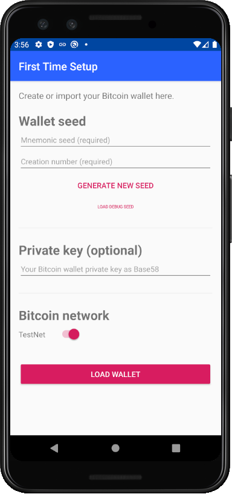 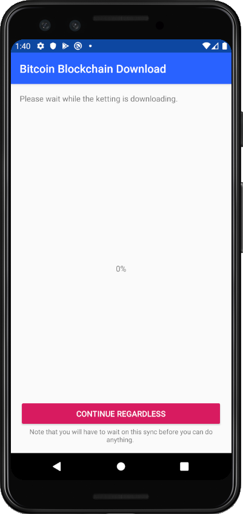 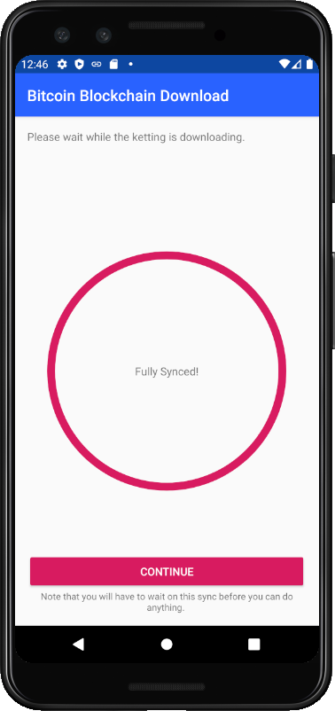 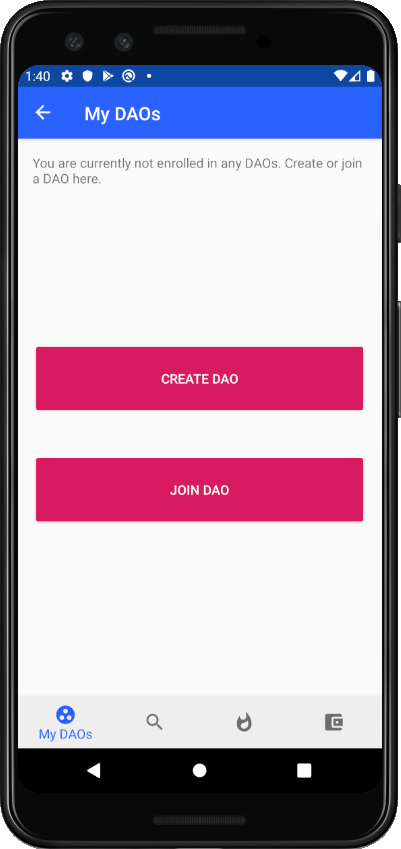

**My DAO Screens**
 
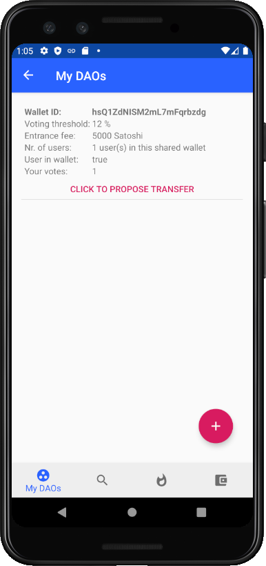 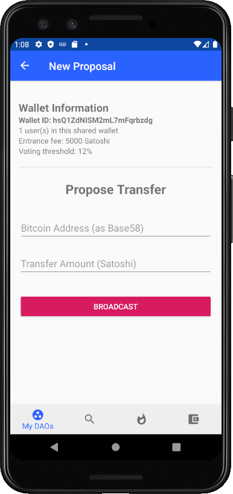 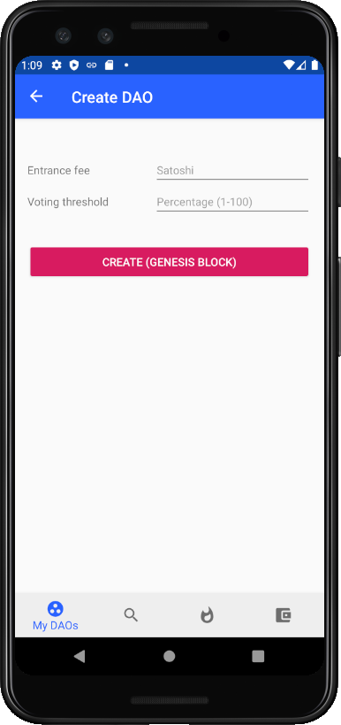

**All DAOs Screens**
 
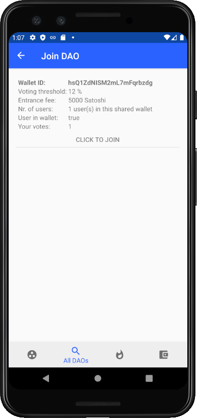

**Proposals Screens**
 
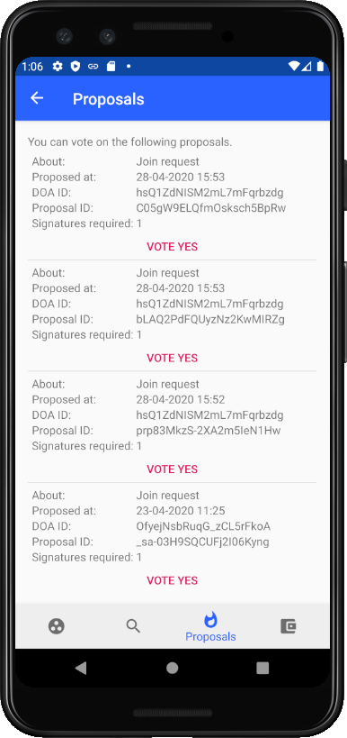

**My Wallet Screens**
 
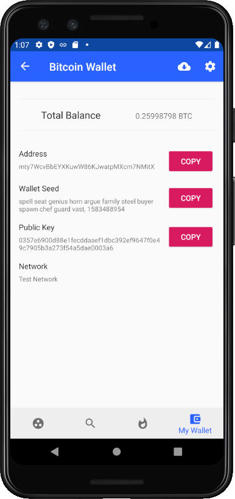 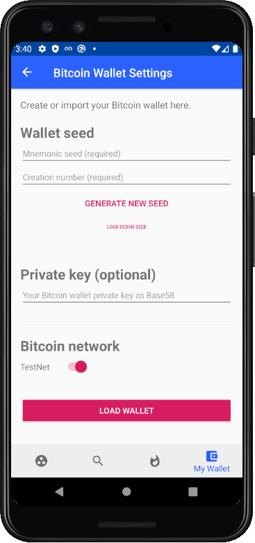

**Duplicate Wallet screen**
 
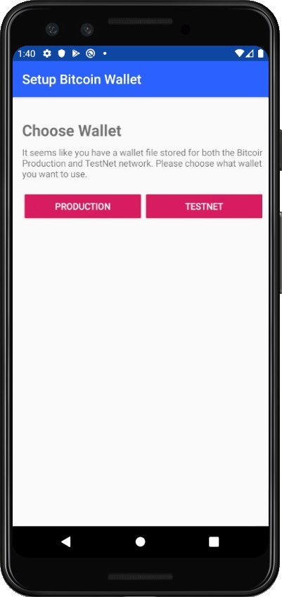

This document contains the project structure, underlying protocol, and known issues and limitations.

## Table of Contents
- [luxury-communism](#luxury-communism)
    - [Table of Contents](#Table-of-contents)
    - [Project Structure](#Project-Structure)
    - [Protocol: The DAO Trustchain Communication Protocol](#Protocol-The-DAO-Trustchain-Communication-Protocol)
        - [DAO Creation](#DAO-Creation)
        - [DAO Joining](#DAO-Joining)
        - [DAO Transfering Funds](#DAO-Transfering-Funds)
        - [Trustchain Message Types](#Trustchain-Message-Types)
    - [Protocol: The DAO Trustchain Communication Protocol](#Protocol-The-DAO-Blockchain-Communication-Protocol)
        - [Personal Wallet and Identity](#Personal-Wallet-and-Identity)
        - [Multi-signature wallets](#Multi-signature-wallets)
        - [Creation](#Creation)
        - [Extension](#Extension)
        - [Transfer](#Transfer)
    - [Known Issues and Limitations](#Known-Issues-and-Limitations)
        - [Protocol Related](#Protocol-Related)
        - [Implementation related](#Implementation-related)

## Project Structure
The project and code is split-up into two parts: Trustchain related code (using [IPv8](https://github.com/Tribler/kotlin-ipv8)) and Bitcoin-related code (using [BitcoinJ](https://bitcoinj.github.io/)). It is composed of several packages, which the most important off are:
- `coin` - The Bitcoin related code that deals with the creation, signing, and broadcast of multi-signature wallets.
- `sharedWallet` - The Trustchain related code that deals with the messages that are present in the protocol.
- `ui` - The code that handles all UI interaction.
- `CoinCommunity.kt` -  The code that handles most of the Trustchain part of the protocol and calls the relevant Bitcoin code.

## Protocol: The DAO Trustchain Communication Protocol
The communication that a DAO needs is:
- Letting the users know a DAO exists (**create**)
- Letting a DAO know that a user wants to join (**join**)
  - Voting on whether users can join a DAO
- Letting the DAO users know that there is a proposal for a fund transfer (**transfer funds**)
  - Voting on whether a fund transfer should go through

We explain each of the communication points in detail.

### DAO Creation
A user that creates a DAO performs the following actions:

- Decide a fixed entrance fee and voting threshold for the DAO
- Pay the entrance fee, create the DAO using the Bitcoin blockchain
- Wait for the DAO creation to be successful (might take some time)
- Broadcast the created DAO on trustchain (self-signed, trustchain block type: `DAO_JOIN` and we automatically add a unique and random DAO id)

This is all fairly straightforward except for the last point. The 'genesis' DAO trustchain block contains information related to the DAO. It also contains the serialized Bitcoin transaction that created the DAO on the Bitcoin blockchain. This transaction is needed for future transactions with this DAO. Additionally, it stores an arraylist of Bitcoin and trustchain public keys of users in the DAO. Now that the DAO exists, other users can join. That protocol is explained in the following section.

### DAO Joining
The first step of joining is finding existing shared wallets. We use `DAO_JOIN` as blocktype that stores DAO information. The created genesis wallet explained previously is also broadcasted using a `DAO_JOIN` block. The user does the following to find existing DAOs:

- Look in the database for `DAO_JOIN` blocks. These blocks contain information about who is in the DAO, which can be used by the user to check whether he is part of the DAO.
- Request `DAO_JOIN` type blocks from other users. At the time of implementation, this was not a function supported by the framework. Therefore, we crawl all blocks and filter on `DAO_JOIN` block types.

A DAO can be joined by a user by following these steps:

- Find a DAO and find the *most recent* `DAO_JOIN` block. This is done using the unique DAO id and trustchain block timestamps. The newest `DAO_JOIN` is needed to fetch the most recent serialized transaction of the DAO, to use for the join DAO transaction.
- Create a Bitcoin transaction `transactionX` for: create a new Bitcoin wallet, transfer all funds from the old DAO, and pay the entrance fee.
- Propose to the existing DAO users to join that wallet, by requesting a signature of each user for `transactionX`.
- Wait for the signatures. At the time of writing this, there is no timeout for waiting. Waiting stops when the app is closed. Additional UI can be added to streamline this process.
- The waiting stops when enough signatures are gathered based on the voting threshold of the existing DAO. Use the signatures to transfer the funds to the new DAO.
- Broadcast the new DAO to the Bitcoin blockchain, with your trustchain and Bitcoin public keys added to the DAO data.

A new DAO is needed for convenience. Joining an existing Bitcoin shared wallet is difficult. Instead, it is easier to create a new shared wallet.

The broadcast of the new DAO is done similarly to a genesis DAO broadcast. An important difference is that the *old DAO unique id is used*.

#### Voting
Voting is a bit more sophisticated. A vote starts by broadcasting a self-signed trustchain block to all users. This block has a certain trustchain block type, `DAO_ASK_SIGNATURE`. We want to note that we initially sent these blocks directly to the DAO users using their trustchain public keys, using a trustchain proposal halfblock. Unfortunately, this made our protocol harder since the trustchain framework automatically transforms a proposal halfblock to a self-signed block if the sender is the same as the receiver. This resulted in unexpected behaviour, since we expect the user to receive his own vote in the same way as other users. We found that the easiest solution to send a self-signed trustchain block to all users. The self-signed proposal block contains the receiver trustchain public key.

Available votes are gathered in the same way as existing DAOs are gathered. Look in the local database and crawl the chains of other users. The found blocks are filtered on voting blocktype and whether the receiver trustchain public key of the trustchain block transaction data is correct.

The voter can respond by replying with a self-signed agreement block. This block has the trustchain blocktype `DAO_SIGNATURE_AGREEMENT`. This is also broadcasted to all users and contains the necessary data. In this case, the signature for the join transaction. Note that we initially did this with agreement halfblocks. We changed to self-signed blocks for the same reason as explained previously.

### DAO Transfering Funds
Individual DAO users can propose a transfer of funds. Voting is done in the same way as explained before (subsection 'Voting'). The self-signed agreement blocks contain the signature of the transfer fund Bitcoin transaction. The protocol can be described in the following way:

- Choose a Satoshi amount to transfer. This should be larger than 5000 and smaller than the available funds (minus the Bitcoin transaction fee)
- Find the most recent `DAO_JOIN` DAO block using the unique DAO id. This block is needed to fetch the most recent serialized Bitcoin transaction
- Create a Bitcoin transaction for this transfer, using the most recent Bitcoin transaction and transfer amount
- Ask for the signatures in the form of voting (similar to join voting: there currently is no timeout for waiting)
- Wait for enough signatures, based on the DAO voting threshold
- Gather the signatures and complete the Bitcoin transaction
- Broadcast a new `DAO_JOIN` DAO block containing the new most recent serialized Bitcoin transaction. *All* other DAO block data remains the same

This completes the create, join and transfer protocols of the trustchain communication side. More detailed information about the Bitcoin protocol can be found in the next sections. We also provide a small section about possible future improvements.

### Trustchain Message Types
The following section includes the specification of the Trustchain message types used.

  
Click to expand.

The data is stored as stringified `JSON`. The `JSON` contains data, which is displayed in the tables below. The [Gson](https://github.com/google/gson) library is used for serialization and deserialization. The block `types` are constants defined in `CoinCommunity.kt`. We prefixed the types with v1 such that newer versions can be added in the future (v2, v3, ...).

**Declared in: `SWJoinBlockTransactionData.kt`**
**Type: `v1DAO_JOIN`**
_Used for broadcasting creation (genesis) and joining shared wallet information_

| Key | Type | Description |
| ------ | ----------- | --- |
| `SW_UNIQUE_ID`   | String | Unique id that will be generated (random 128 bit string) |
| `SW_ENTRANCE_FEE` | Long | Satoshi amount required for a single vote in the DAO |
| `SW_VOTING_THRESHOLD`    | Int | 0-100, voting percentage required for decisions |
| `SW_TRUSTCHAIN_PKS`    | List<String> | Trustchain public keys of users in the wallet |
| `SW_BITCOIN_PKS`    | List<String> | Bitcoin public keys of users in the wallet |

**Declared in: `SWSignatureAskTransactionData.kt`**
**Type: `v1DAO_ASK_SIGNATURE`**
_Used for starting a (Bitcoin) transaction proposal that requires signatures_

| Field Name | Type | Description |
| ------ | ----------- | --- |
| `SW_UNIQUE_ID`   | String | The unique shared wallet id |
| `SW_UNIQUE_PROPOSAL_ID` | String | The unique proposal id |
| `SW_TRANSACTION_SERIALIZED`    | String | The serialized (Bitcoin) transaction for which a signature is asked |
| `SW_PREVIOUS_BLOCK_HASH`    | String | Trustchain block hash of the latest DAO_JOIN block |
| `SW_SIGNATURES_REQUIRED`    | Int | The number of required signatures (converted from shared wallet voting threshold percentage) |
| `SW_RECEIVER_PK`    | String | The trustchain public key of the receiver of this signature ask block |

**Declared in: `SWResponseSignatureTransactionData.kt`**
**Type: `v1DAO_SIGNATURE_AGREEMENT`**
_Used for storing signature data_

| Field Name | Type | Description |
| ------ | ----------- | --- |
| `SW_UNIQUE_ID`   | String | The unique shared wallet id |
| `SW_UNIQUE_PROPOSAL_ID` | String | The unique proposal id |
| `SW_SIGNATURE_SERIALIZED`    | String | The serialized (Bitcoin) signature for a transaction |

**Declared in: `SWTransferFundsAskBlockTD.kt`**
**Type: `v1DAO_TRANSFER_ASK_SIGNATURE`**

_Used for proposing a new transfer funds transaction_

| Field Name | Type | Description |
| ------ | ----------- | --- |
| `SW_UNIQUE_ID`   | String | The unique shared wallet id |
| `SW_UNIQUE_PROPOSAL_ID` | String | The unique proposal id |
| `SW_PREVIOUS_BLOCK_HASH`    | String | Trustchain block hash of the latest DAO_JOIN block |
| `SW_BITCOIN_PKS`    | List<String> | Bitcoin public keys of users in the shared wallet |
| `SW_SIGNATURES_REQUIRED`    | Int | Bitcoin public keys of users in the shared wallet |
| `SW_TRANSFER_FUNDS_AMOUNT`    | Long | The number of required signatures (converted from shared wallet voting threshold percentage) |
| `SW_TRANSFER_FUNDS_TARGET_SERIALIZED`    | String | Bitcoin public key of the wallet that received the transfer funds amount |
| `SW_RECEIVER_PK`    | String | The trustchain public key of the receiver of this transfer signature ask block |

**Declared in: `SWTransferDoneTransactionData.kt`**
**Type: `v1DAO_TRANSFER_FINAL`**
_Used for broadcasting valid Bitcoin transactions (posted on Bitcoin, enough signatures)_

| Field Name | Type | Description |
| ------ | ----------- | --- |
| `SW_UNIQUE_ID`   | String | The unique shared wallet id |
| `SW_UNIQUE_PROPOSAL_ID` | String | The unique proposal id |
| `SW_TRANSACTION_SERIALIZED`    | String | The serialized (Bitcoin) transaction that is valid and done |
| `SW_BITCOIN_PKS`    | List<String> | Bitcoin public keys of users in the shared wallet |
| `SW_TRANSFER_FUNDS_AMOUNT`    | Long | Satoshi amount that is transfered |
| `SW_TRANSFER_FUNDS_TARGET_SERIALIZED`    | String | Bitcoin public key of the wallet that received the transfer funds amount |

## Protocol: The DAO Blockchain Communication Protocol
As mentioned earlier, every DAO has a collective Bitcoin multi-signature wallet which it derives her utility from by allowing participants to collectively manage money. This wallet is stored on the Bitcoin blockchain in the form of a single transaction. The collective funds are locked at a single output of this transaction. This is done using [the standard](https://bitcoin.org/en/transactions-guide#standard-transactions) m-n multi-signature script.

This section will explain the Bitcoin procedures that are called upon by the different events that occur in the Trustchain protocol.

### Personal Wallet and Identity
Before looking at the actual protocol, we will shortly describe the personal wallet and our implementation. To use the protocol, a user needs to have a personal wallet which simply is a collection of UTXOs that the user can sign with his/her keys.

Using BitcoinJ, a wallet is made with a random mnemonic code defined by the [BIP39](https://github.com/bitcoin/bips/blob/master/bip-0039.mediawiki) standard. From this mmnemomic code (and several intermediate steps) a set of private and public keys pairs can be created in a deterministic fashion.

In all procedures, the *first key pair in this set* will be used to identify a user. This key pair will be used in the multi-signature output scripts and will be used to sign transactions. In other words, the mnemonic code (indirectly) represents the identity of the user in the protocol.

However, note that any of the key pairs in the wallet can be used to pay the entrance fees to join a DAO.

###  Multi-signature wallets
As mentioned earlier, a multi-signature wallet is a Bitcoin transaction. The funds of a multi-signature wallet are locked in an output using a corresponding [`scriptPubKey` ](https://en.bitcoin.it/wiki/Transaction#Output) which conceptually includes two data items. We will name this output the multi-sig output.
- The participants in the form of a list of Bitcoin public keys
- The minimum amount of signatures of participants needed to successfully unlock the output

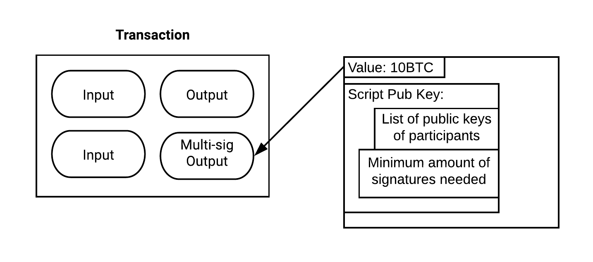

The multi-sig output can be spent by creating a new transaction and using the output as an input. However, to unlock the output, the minimum amount of signatures from the participant's keys are needed. The signatures in question are the new transaction signed with the corresponding private keys. Using these signatures, a valid [`scriptSig`](https://en.bitcoin.it/wiki/Transaction#Input) can be created which can unlock the multi-sig output and allow it to be spent to another address

### Creation
Creation and broadcast of the initial multi-signature wallet are always done by a single participant and can be done without any pre-requisites. The participant essentially creates a 1-1 multi-signature wallet with the funds equal to the specified entrance fee, originating from a personal wallet.

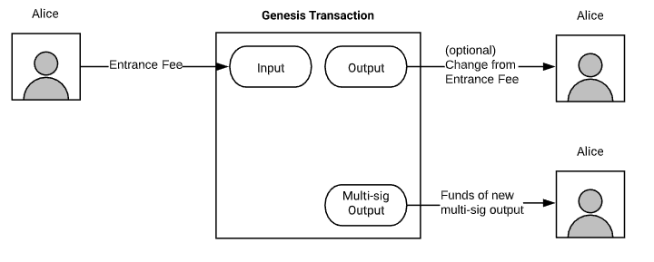

### Extension
A user joining an existing multi-signature wallet does so using a single transaction. We will name this the `new transaction` and the existing multi-signature wallet the `old transaction`. This new transaction contains the following information:

- **Input 1:** The `entrance fee` paid by the joining user from a personal wallet.
- **Input 2:** The `old funds` of the multi-sig output of the existing multi-signature wallet.
- **Output 1:** (Optional) In case `input 1` is larger than the `entrance fee`, the `change amount` can be sent to a change address owned by the joining user.
- **Output 2:** The new locked multi-signature output. This value is equal to the `entrance fee` + `old funds`.
    - The list of participants is the old participants including the joining user.
    - The new minimum amount of signatures needed is set by the Trustchain Protocol.

Note that the joining user does not initially possess the minimum amount of signatures needed to sign `input 2` (the multi-sig output of the old transaction). The Trustchain protocol solves this problem of voting/collecting the minimum amount of signatures needed from participants.

Note that while this two-step protocol does introduce complexity, the protocol can now perform the extension atomically using a single transaction. This is to provide guarantees to:
- The participants (which sign) that the joining user fairly pays the entrance fee.
- The joining user that the participants don't leave his/her public key out of the new multi-sig output and steal the fee.

### Transfer
A transfer of funds from an existing multi-signature wallet is also done in a single transaction. This can, for example, be a transfer of funds from a multi-signature wallet to a developer in question, with address `payment address` and the amount we want to send as as `payment amount`.

The new transaction contains the following information.

- **Input 1:** The `funds` of the multi-sig output of the multi-signature wallet.
- **Output 1:** (Optional) In case `funds` is larger than the `payment amount`, the `change amount` can be sent to a new multi-sig output which has the same details as the current multi-sig output. This is to ensure no funds get lost.
    - The list of participants is the same as in the old multi-sig output.
    - The new minimum amount is the same as in the old multi-sig output.
- **Output 2:** The `payment amount`  going to the `payment address`.

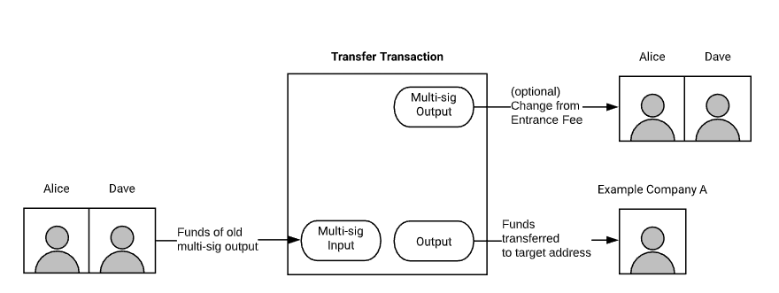

Again, to sign `input 1` (the multi-sig output of the old transaction), the Trustchain protocol solves this by voting/collecting the minimum amount of signatures needed from participants.

The new transaction does two things simultaneously:
- Send the payment amount to a payment address.
- In case there are funds left, automatically create a new multi-sig output.

This new transaction will thus also be regarded as the latest transaction presenting the multi-signature wallet for a particular DAO.

## Known Issues and Limitations
The project was created in a short time-span and there are several identified issues and limitations which may pose problems.

### Protocol Related
- **Transaction Validation:**
    - Broadcasted Bitcoin transactions are serialized and send to other users through Trustchain blocks. Upon receiving a block, the transaction is assumed to be valid and successfully broadcasted. There is no external validation (e.g. to a local copy of the Bitcoin blockchain) to see if the transaction was broadcasted.
    - The reason for this limitation mainly is due to implementation details regarding the BitcoinJ client, which does not (easily) allow retro-actively fetching transactions from addresses that are not being watched.
- **Privacy Considerations**:
    - While users are anonymous and only known by their key pair, the use of the same key pair throughout the protocol does open up the user to be tracked by a party collecting all the broadcasted information regarding the key pair.
- **MITM attack:** With the current implementation used (IPv8/Trustchain), the system is susceptible to MITM attacks.

### Implementation related
The most important improvement is regarding the collection of votes. A UI can be added for this, such that the users can see the current status of his proposal. Currently, the vote becomes invalid whenever another transaction is done with the same DAO, since the most recent found serialized transaction would be not the most recent. A timeout can be added to make sure the vote does not go on for an unreasonable amount of time. Both improvements need to be visible to the user in the DAO UI.

Currently, the `DAO_JOIN` DAO blocks contain the full list of public keys. This can be improved regarding space efficiency by only including the public keys of the new user. That way, the DAO blocks only contain 2 public keys at most (trustchain and Bitcoin public key). Compared to a DAO with 1M users (or even more), this is a necessary space reduction.

To follow up on space efficiency, the serialized Bitcoin transaction should be stored elsewhere. One solution is off-chain storage, but other solutions exist. With more users, the serialized Bitcoin transaction increases in size. This can become a problem with a lot of DAO users.

The voting protocol can be improved to properly use proposal and agreement halfblocks. We decided not to due to the limited development time that we have. Directly sending it to other DAO users (and not the entire community) reduces the number of messages in trustchain.

