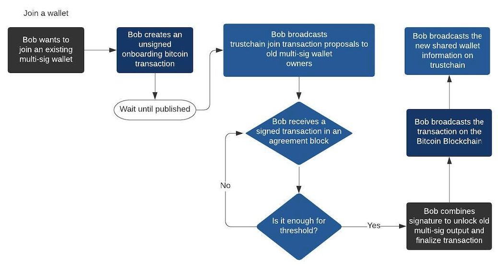

# Wallet Protocol

Data is stored in the transaction data map of trustchain blocks. The `message` key is assigned to a string containing JSON data. Due to the limited time we have, our initial idea is to store as many information as possible, to make the entire process as easy as possible. Less data storage is possible (see [Future improvements](#Possible-future-improvements))

Shared wallet and transfer funds proposals are identified with a unique identifier. This identifier is a randomly generated 128 bit string.

## Start a shared wallet

## Join an existing shared wallet

## Transfer funds from an existing shared wallet

## Possible future improvements

We discuss some of the improvements that came to light during the development process.

- The genesis shared wallet block is the only block that needs to store the transaction fee and voting threshold, since we do not allow the DAO users to change those values.
- Each block that indicates that a new user joined the shared wallet (after paying the fees and possible other requirements) only needs to contain the public bitcoin and trustchain key of the new user. The other keys can be derived from the previous shared wallet blocks, based on the unique trustchain shared wallet ID.
- ... much more probably
