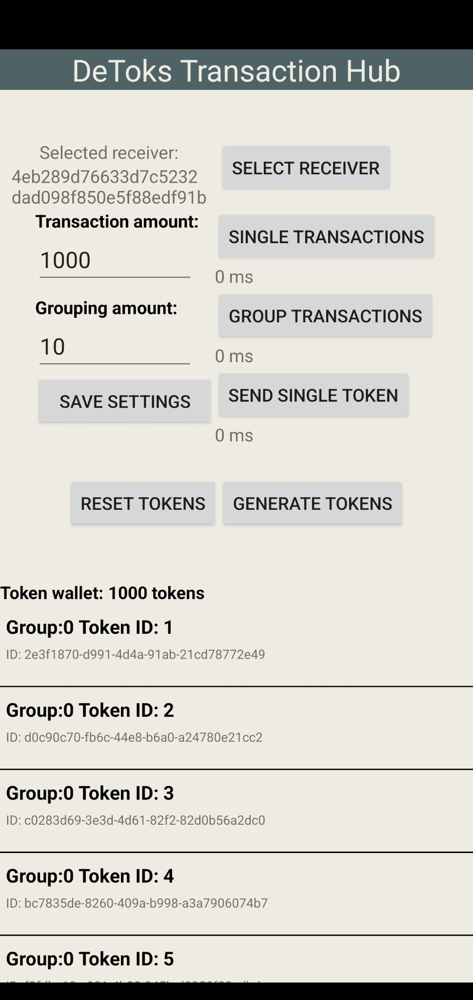
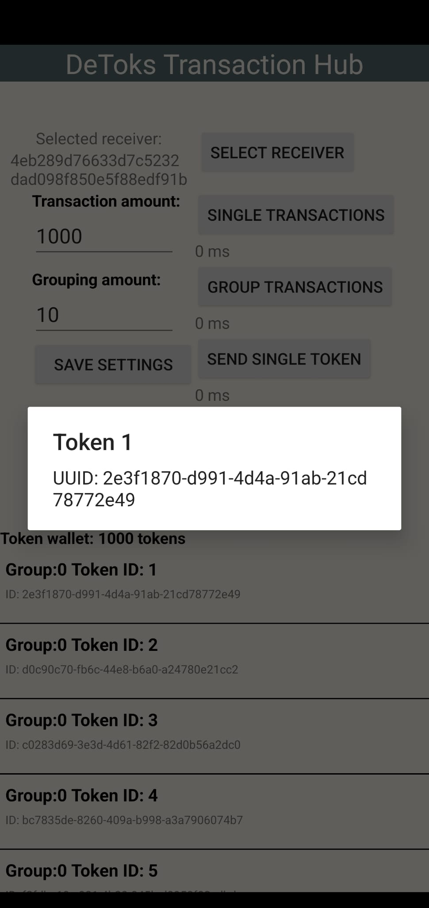
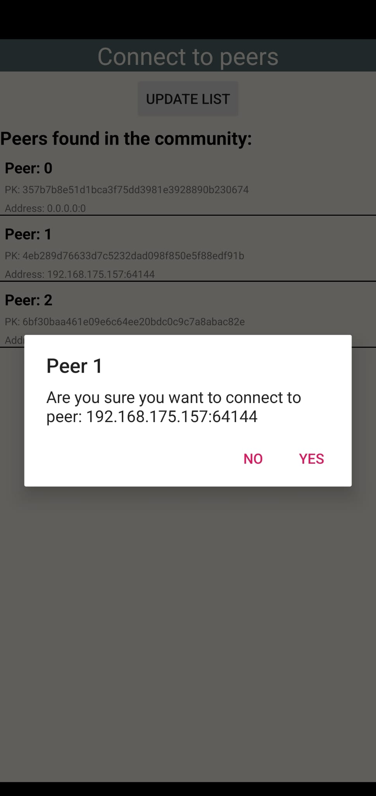
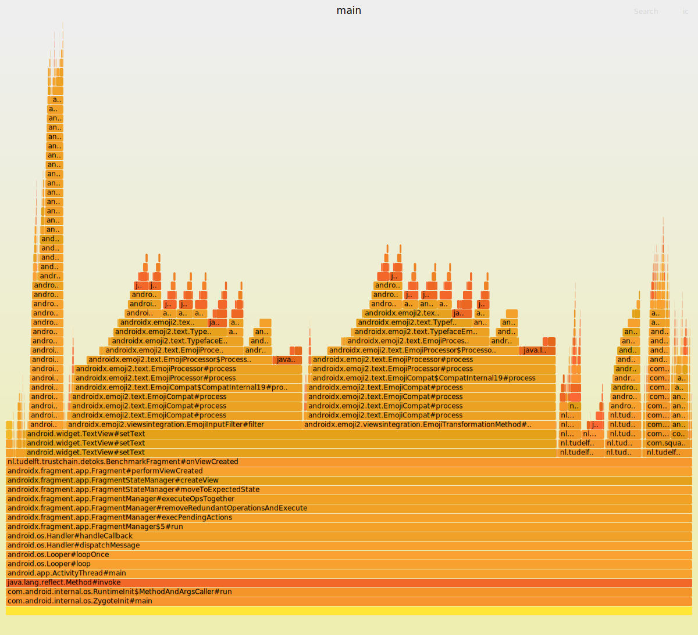

# Detoks Transaction Engine group III    
DeToks is an Android application built on top of [IPv8](https://github.com/Tribler/kotlin-ipv8) and is integrated into the [TrustChain Superapp](https://github.com/Tribler/TrustChain-superapp). DeToks' purpose is to be a blockchain-based alternative version of Tiktok built from scratch. DeToks is built upon a token economy in which users earn tokens by hosting content and spend tokens to consume content. Underneath all of this lies a transaction engine, an API that allows users to perform token transactions quickly and reliably.

This project presents a token transaction engine API built on top of the [TrustChain Community](https://github.com/Tribler/kotlin-ipv8/blob/master/doc/TrustChainCommunity.md). Next to sending single tokens, our engine additionally allows to perform single and multiple transactions in order to increase transaction througput. Through grouping of transactions, we are able to send 1000 transactions within roughly 5 seconds, all the while ensuring integrity through the TrustChain. This report will describe our process and design, and is further divided into the following sections:  
* **Design of DetoksTransactionEngine**: A description of the structure of the transaction engine, the tokens, fragments, and so forth. We additionally describe our design choices in the development process.  
* **API**: A detailed description of how to use the functions in the DetoksTransactionEngine for future works.  
* **Benchmarks design and results**: Presentation of performed benchmarks.
* **Limitations encountered**: An outline of the limitations encountered during the project and their implications on our work.   
* **Future Works**: Possible improvements that can optimize or extend our work.  
  
  
## Table of Contents  
- [DeToksTransactionEngine](#DetoksTransactionEngine)  
  - [Table of Contents](#Table-of-contents)  
  - [Project Structure](#Project-Structure)  
  - [Transaction Engine](Transaction-Engine)  
      - [Token Structure](#Token-Structure)  
      - [Database design](#Database-design)  
      - [UI](#UI)  
      - [Transaction Engine Features](#Transaction-Engine-Features)  
      - [Contrib proposal and agreement blocks over TrustChain](#Contrib-proposal-and-agreement-blocks-over-TrustChain)  
      - [Design choices to group transactions](#Design-choices-to-group-transactions)  
      - [Unit Tests](#Unit-Tests)  
  - [API](#API)  
      - [Single Transaction](#Single-Transaction)  
      - [Multiple Transactions](#Multiple-Transactions)  
      - [Receiving Proposal Blocks](#Receiving-Proposal-Blocks)  
      - [Receiving Agreement Blocks](#Receiving-Agreement-Blocks)  
  - [Benchmarks design and results](#Benchmarks-design-and-results)  
      - [Benchmark Single Transaction](#Benchmark-Single-Transaction)  
      - [Benchmark Grouped Transaction](#Benchmark-Grouped-Transaction)  
      - [Optimized parts and bottlenecks](#Optimized-parts-and-bottlenecks)  
  - [Limitations encountered](#Limitations-encountered)  
      - [TrustChain limitations](#TrustChain-imitations)  
      - [Coroutines for sending multiple single transactions](#Coroutines-for-sending-multiple-single-transactions)  
      - [Coroutines for creating multiple blocks](#Coroutines-for-creating-multiple-blocks)  
      - [Network Inconsistency](#Network-Inconsistency)  
  - [Future works](#Future-works)  
      - [Multiple blocks broadcasted at once](#Multiple-blocks-broadcasted-at-once)  
      - [Remediation for lost packets](#Remediation-for-lost-packets)  
  
  
  
## Transaction Engine  
In the context of the DeToks project, the transaction engine is a module that allows sending tokens to other peers. In doing so, peers should be able to freely use the DeToks app without any noticeable delay in the user experience.  This means that the transaction engine should be fast; transactions should happen in the background in orders of milliseconds, but also reliable; integrity should be maintained automatically while the service remains available.  
  
The transaction engine presented in this report aims to  fulfill both of these points. It is a modular transaction engine built on top of the [IPv8](https://github.com/Tribler/kotlin-ipv8) network overlay.  To ensure integrity and validity, it builds upon the [TrustChain Community](https://github.com/Tribler/kotlin-ipv8/blob/master/doc/TrustChainCommunity.md).  One of the key features of TrustChain is its resistance to Sybil attacks, which occur when a malicious entity creates multiple identities to gain control over the network. Additionally, TrustChain offers retrospective validation and integrity through the use of tamper-proof, temporal ordered, and cryptographically signed transaction records to create irrefutable proof of past interactions.  
  
To create our token transaction engine, we extend on TrustChainCommunity, inheriting all of its properties, and adding the following features:  
- **Sending single tokens**: The transaction engine allows to send a token in a single transaction to another peer.  
- **Grouped transactions**: The transaction engine allows for the grouping of multiple transactions meant for the same peer, where every transaction is a list of tokens.
  

### Token Structure  
To realize our transaction engine, we have opted for the use of 'owned' virtual tokens as a way to dictate users' balance instead of an integer balance. We have opted for this choice as this would, in future work, allow us to validate ownership of specific tokens through the TrustChain network by tracking its course through the network recorded in the TrustChain. Unfortunately, due to the limited availability of hardware, it was infeasible for us to test our engine on a large network of peers. Integrity validation of a transaction requires to crawl through blocks from multiple peers, which was infeasible to simulate on our machines. Instead, we opted to focus more on transaction efficiency _whilst keeping our design suited for integrity validation in the future_. 

  
As for the design of the token, we use a simple design; each token consists of a [UUID](https://docs.oracle.com/javase/7/docs/api/java/util/UUID.html) and an integer ID, of which the latter only functions for debugging. UUIDs are widely used as a method to create unique IDs for each object, which we use in the DeToks Transaction Engine as a way to identify a single token.  
    
### Database design  
This choice in the use of tokens required local storage of tokens.  Each peer keeps track of their currently owned tokens in an SQLite database. SQLite was opted for as it is a lightweight server-less relational database management system suitable for embedded systems such as phones.  
  
To further increase token transaction efficiency, we aimed to keep the number of database accesses to a minimum, as we found that database accesses were quite straining on runtime. To handle the grouping of transactions more efficiently, we used [SQLite transactions](https://cashapp.github.io/sqldelight/2.0.0-alpha05/android_sqlite/transactions/). These transactions allow you to execute multiple statements under a single database transaction.  
  
  
### UI  
The UI consists of two fragments: the Benchmark Fragment and the Peer Connection Fragment.  
  
The Benchmark Fragment, or the 'DeToks Transaction Hub', functions as a central hub to perform benchmarks.  To start off, a user can select the peer to which it wants to send tokens by pressing the 'select receiver' button.  This navigates the app to the other fragment; the Peer Connection Fragment.  
  
This fragment scans the network for peers connected to the DeToksTransactionEngine, and automatically updates the list of available peers.  Upon pressing a listed peer, the user is prompted to confirm that they want to connect to this peer, returning the app to the Benchmark Fragment upon confirmation.  
  

  
  
  
Once returned in the Benchmark  Fragment, the connected peer field will be updated, making us ready to send tokens. The list on the bottom of the screen denotes your current token wallet, showing each token found in your local database. This token list is automatically updated once a change to your wallet happens and can be interacted with by pressing on a single item.  
  
Furthermore, the Benchmark Fragment allows for various modes of sending under various settings, which are described in the next subsection.  
  
### Transaction Engine Features  
Within the Benchmark fragment, as shown above, there are many UI elements to use and simultaneously benchmark the DeToks transaction engine. First of all, your token balance is shown in the aforementioned token list, which can be edited by either resetting your token balance or generating additional tokens with the two buttons above it.  
  
The user can select the amount of tokens to be sent with the `transaction-amount` input field. This will set the amount of tokens to be sent with the various modes of sending described below. Additionally, this amount also sets the amount of tokens to be generated with the **Generate tokens** button. Since this project was only used for benchmarking, these two amounts are linked. Furthermore, the user can change the `grouping-amount` selector to change the amount of transactions grouped when using the **Grouped Transactions** mode of sending.  
  
Once a peer is selected ([sending to self](#Sending-to-self) is also possible), tokens are available and the sending parameters have been set, the user can choose from three modes of sending:  
- **A single transaction** - send a single token from your wallet to the selected peer.  
- **Single Transactions** - starts the 'single transaction' benchmark. Sends an amount of single proposal blocks based on the selected `transaction-amount`.
- **Grouped Transactions** - starts the 'grouping transaction'. Sends `transaction-amount` of tokens, grouped together in proposal blocks, with `grouping-amount` tokens grouped per proposal block.  
  
After the full transaction benchmark has finished, e.g. the receiving peer has responded with agreements and the sending peer has received agreements for all of its proposals, the benchmarked time is displayed beneath the button used to start the selected benchmark.  
  
Additionally, we attempted two other methods of sending in order to increase transaction throughput, both using coroutines. However, these two methods proved to be infeasible, of which a discussion can be found in the [limitations](#Coroutines-for-sending-multiple-single-transactions) section.  
  
#### Sending to self  
For debugging purposes, sending to yourself is also possible. This is your default selected peer; in case you do not select any other peer, you will send to yourself. In this case, UUIDs are regenerated each time you receive tokens from yourself to avoid duplicate ID errors in the local database.  
  
  
### Contrib proposal and agreement blocks over TrustChain  
We decided to develop our engine using the [TrustChain Community](https://github.com/Tribler/kotlin-ipv8/blob/master/doc/TrustChainCommunity.md) so that we can make transactions following the operation explained by [ConTrib: Universal and Decentralized Accounting in Shared-Resource Systems](https://dl.acm.org/doi/pdf/10.1145/3428662.3428789). In addition to the token database we have implemented, we also use a tamper-proof distributed ledger for each peer to maintain the blocks that make up the transactions. The half-block structure details can be found in the [TrustChain Community](https://github.com/Tribler/kotlin-ipv8/blob/master/doc/TrustChainCommunity.md). In our engine, we reuse the same logic implemented in the TrustChain community to perform transactions, adapting it to our token-based design.  
A transaction between A and B is performed in the following way:  
- First, A creates a proposal block containing a list of Tokens as the transaction. 
- A signs the proposal block, saves it in its block database, sends it to B, and broadcasts it to the network.
- Peers other than B that are not involved in the transaction will just store the block.  
- Upon receiving the proposal block, B validates its integrity. If the block is valid and B agrees with the proposed transaction, B stores the tokens sent by A in its token database and creates an agreement block, containing a list of the _unique ids_ of the tokens sent by A as the transaction.  
- B signs and stores the agreement block and sends it back to A by broadcasting it to the network.  
- Upon receiving the agreement block, A removes all of its locally stored tokens that have the same _unique ids_ as contained in the agreement block sent by B. After that, the transaction is considered to be completed.  

In addition, some half-blocks might be lost due to packet loss as described in [Network Inconsistency](#Network-Inconsistency). We chose to introduce a resending mechanism to properly complete transactions, while avoiding losing tokens, re-entering tokens twice into the database (which would generate errors), and making sure that, ultimately, we get the two half-blocks that would make up the transaction. 

Packet loss implies two different events: proposal half-block loss and agreement half-block loss.
For the first scenario, we chose to remove tokens only upon receiving the agreement half-blocks. This prevents loss of tokens contained in that lost block. Therefore, losing a proposal half-block merely results in the transaction not occurring.

The second scenario poses a more difficult problem. In this case, we would be in a situation where A (the sender) and B (the receiver) would have the same tokens in their database, as A never got a confirmation of the transaction such that they could remove the tokens. 

The resend mechanism that remedies this works as follows: after a fixed timeout, a new half-block proposal with the same tokens and a _resend_ field is sent back to B. When B receives the proposal half-block with the _resend_ field, it first checks whether the tokens contained in the block transaction are not already in their token database. If they are already there (second scenario), B proceeds to create a new half-block agreement and sends it back to A so that the transaction can be completed. If, on the other hand, the tokens are not present, then the first scenario occurs as described above and a completely new transaction is created. 

### Design choices to group transactions  
One of our main optimizations is to send multiple transactions destined for the same peer in a single half-block. This reduces the number of packets sent in the network and thus increases the speed at which these transactions would be done if processed separately from each other. In performing grouped transactions, we considered a single transaction to be a list of tokens and not a single token. We chose to keep the different token lists divided to be able to distinguish transactions, instead of merging all tokens into a single list. This allows us to have a record of the different transactions made between the two peers, even if we send multiple transactions in the same half-block.
  
### Unit Tests  
We have implemented several unit tests to test the IO-operations of our app. This entails token creation and token operations within the database.  We attempted to create larger integration tests, but unfortunately, we did not manage to do this since this would require the hosting of virtual devices.  

## API  
In this section, we give a detailed description of the implementation of the various ways our transaction engine can send tokens to other peers, on how one should use them in future work. Keep in mind that our transaction engine extends the [TrustChain Community](https://github.com/Tribler/kotlin-ipv8/blob/master/doc/TrustChainCommunity.md), thus making it possible to extend its functionality with TrustChain community functions. These include for example custom listeners, half-block pair broadcasters, and crawl requests and responses.

### Single Transaction  
To send a single token and create a transaction (creating a half-block proposal) to a selected peer, the function **sendTokenSingle(token: Token, peer: Peer): TrustChainBlock** can be used.  
This function takes as parameters the token you want to send and the selected peer and sends a proposal half-blocks containing the token as a transaction.

The token is first transformed into string such that it can be stored in the 'transaction' field of the block. Additionally, the resend boolean originating from the resend mechanism is also recorded in the block, which will be used by the receiver.

The tokens are not removed from the database until an agreement half-block sent by the selected peer is received. Once the agreement has been processed by the sender, the transaction is complete.

### Multiple Transactions  
To perform multiple transactions at once with a single peer, the function **sendTokenGrouped(tokenList: List<List<Token>>, peer: Peer, resend: Boolean): TrustChainBlock** can be used.  

Again, this function takes as parameters a list of tokens for every transaction that has to be performed, and the selected peer. This list of tokens is transformed into a list of strings to be stored in the 'transaction' field of the block. Additionally, the resend boolean is also recorded in the block, which will be used by the receiver. The tokens involved in every transaction are not removed from the database until an agreement half-block sent by the selected peer is received. 

For details on the performance comparison between the two functions above, please refer to [Benchmarks design and results](#Benchmarks-design-and-results).  

### Receiving Proposal Blocks  
The functions **receiveSingleTransactionProposal(block: TrustChainBlock)** and **receiveGroupedTransactionProposal(block: TrustChainBlock)** process the incoming proposal half-blocks received, store the tokens collected from the blocks and automatically create agreement half-blocks based on the proposal half-blocks received. These functions are used in the block listeners.  

Furthermore, if the resend boolean recorded in the block is true, then we additionally check if the token is already stored in the local database before adding it. This had to be done due to the fact that, sometimes, blocks would arrive at the sender multiple times. This phenomenon is described in more detail in [Network Inconsistency](#Network-Inconsistency).

### Receiving Agreement Blocks  
The functions **receiveSingleTransactionAgreement(block: TrustChainBlock)** and **receiveGroupedTransactionAgreement(block: TrustChainBlock)** process the incoming agreement half-blocks to finalize the transaction. The functions process the string representation of the transaction in the block and remove tokens from local storage accordingly. These functions are also used in the block listeners. 

## Benchmarks design and results  

The goal for this project was to have a transaction engine that is able to process 1000 transactions per second with standard 4G connectivity. We define the *processing time* of the transaction engine as follows: the total time for execution, starting when the first proposal block is sent, and ending after the last agreement block is received by the sender. The measured processing time is dependent on various conditions. The network speed, congestion, and packet loss  can all lead to various processing times. 
  
We performed 10 executions of sending 1000 transactions with each sending method and computed the average processing time for both methods. Results can be found below.  
  
### Benchmark Single Transaction  
In order to find out to what extent grouped transactions improved the total execution time, we first measured the time it takes to send 1000 transactions without grouping. The results were as follows:

SingleTransaction(2x) (1000 tokens):=

| Device:  | Emulator: |
|----------|-----------|
| 67630 ms | 96888 ms  |
| 68994 ms | 97372 ms  |

Device average  =  68312 ms
Emulator average = 97130 ms

We also checked how long a single transaction takes. Measuring this gave the following results:
SingleToken:
Device:		Emulator:
891 ms			186 ms
388	ms			603 ms
487	ms			969 ms
669	ms			402 ms
337 ms			626 m

Device average = 554,4 ms
Emulator average = 557.2 ms

### Benchmark Grouped Transaction  
Measuring the processing time of grouped transactions gave the following results:

GroupedTransaction(5x) GroupSize 10:
| Device: | Emulator: |
|---------|-----------|
| 4101 ms | 7706 ms   |
| 4396 ms | 7177 ms   |
| 3460 ms | 15461 ms  |
| 5611 ms | 7702 ms   |
| 5410 ms | 13550 ms  |

Device average = 4595,6 ms
Emulator average = 10319,2 ms

### Performance flamegraph
In order to assess the performance of our app we generated a flamegraph. The resulting flamegraph can be seen here: \

### Discussion on results
The benchmarks above highlight some interesting results that we would like to analyze more and discuss.
The first remarkable difference that we can see is the performance of the device compared to the performance of the emulator. This is probably due to the limited resources available in the emulator. Furthermore, the emulator presents more inconsistent results in the benchmarks, with a higher deviation from the average time compared to the device. A possible explanation for the divergent results in the benchmark cases may be the resending mechanism in some of the benchmark cases, which inevitably leads to a higher processing time.
Secondly, it can be clearly seen that grouped transactions greatly improve performance as the execution time is significantly shorter than the execution time of ungrouped single transactions. It is interesting to report that, when we tried to use higher group sizes (100), in order to reduce the number of exchanged packets, the performance was drastically slower than using lower group sizes like 10 (in the order of ~30s). It may be interesting to investigate the optimal group size for which the performance is fully optimized.
Ultimately, we would like to point out that our design choice of relying on Trustchain to perform transactions limited the performance. Although Trustchain helped to have a better network consistency ( compared to using directly normal IPv8 overlay), it is not designed to perform quickly multiple transactions, so we could not achieve the goal of 1000 transactions per second. For future works, if the transaction processing time is very relevant, we will discuss some possible ideas to improve performance in [Future works](#Future-works).  

## Limitations encountered  
The development of the transaction engine following our implementation choices and design choices resulted in numerous limitations that we had to deal with. Below we detail the various problems we encountered, why we encountered them, some of the solutions we thought of to remedy them but that didn't work, and what partially helped to optimize the engine.

### TrustChain limitations  
One of the most significant design choices was to use TrustChain community instead of the simpler community in order to reuse the half-block architecture, creation, sending, storage, validation, and everything else it already implements. This provided interesting properties to our engine, such as being Sybil-resistant, but also implied limitations in performance. The operations within TrustChain community, with the features described above, introduce more time-consuming operations than simply sending an unencrypted token via the `ipv8` overlay. This is reflected heavily in the measured performance and has greatly impacted our results.  

### Coroutines for sending multiple single transactions  
One approach we considered in trying to optimize the transaction engine was to use Kotlin's coroutines to perform multiple transactions in parallel by creating and sending multiple proposal half blocks simultaneously. This solution, after several attempts, was not chosen for two main reasons:  
- During benchmarks using 1000 transactions, we noticed that sending 1000 packets simultaneously to a peer(received asynchronously), who then has to process them and send the corresponding agreement half-blocks, creates congestion and causes severe packet loss. This consequently had a very significant impact on performance, and thus was dropped as a potential solution.
- The half-block structure includes a **sequence number**, the sequence number of the block in the chain of the initiator of the block, and a **previous hash**, the SHA256 hash of the previous block in the chain of the initiator of the block. 
In some cases, the use of coroutines resulted in blocks that were created and sent at different times. This caused errors at the receiver, as they would receive blocks that link to unknown blocks, invalidating the links stored in the aforementioned fields.

  
### Coroutines for creating multiple blocks  
To partially use the optimization described in the [previous subsection](#Coroutines-for-sending-multiple-single-transactions), we thought of using coroutines to create proposal half blocks simultaneously without storing them, and then sequentially validating, storing, and sending them in order to avoid congesting the receiver's network. This introduced another problem, though: when creating all the half-blocks at the same time, they would have the same **sequence number** and **previous hash** of the latest block in the chain of the sender; their validation and storing would have also invalidated and corrupted the chain.  

### Network Inconsistency  
The IPv8 overlay, while it made it easier to send messages, caused us some problems during the development of the engine. More specifically, in creating our community, we always found peer discovery, which is being able to locate other devices connected to the same community, to be inconsistent. Plus, most of the time we encountered packet loss in the network, which combined with the stateless UDP protocol that TrustChain uses, is not notified. This meant that we had to implement a resending mechanism, as described in the [transaction engine section](#Contrib-proposal-and-agreement-blocks-over-TrustChain). Next to that, we found that, occasionally, blocks would arrive multiple times. This required us to add additional duplicate ID detection mechanisms to avoid faults. 
  
## Future Works  
In this section, we report some ideas that could be implemented in the future to improve the performance of the engine and expand its functionality to apply it to different uses.
### Remediation for lost packets  
Although the choice to use the TrustChain community to exchange tokens has greatly limited packet loss, if one wants to be certain of completing transactions one must keep in mind that both the proposal half-block and the agreement half-block could be lost. Creating new blocks containing the same transactions would place a new block into the network containing the same transaction as one already shared, in addition to having an incomplete half-block pair. The correct implementation of a mechanism to remedy packet loss should not create half blocks again, but retrieve those already used and stored in the TrustStore and re-exchange them with the target peer and the network, in order to properly complete the transaction and maintain the correct blocks.  
### IPv8 messages or smart broadcast  
The way TrustChain makes use of halfblocks and performs creation, signing, validation, storage, and sending, requires a considerable amount of computation time. If you are aiming for a faster and quicker engine without necessarily having the need for this process there are two main options:  
- Use only the `ipv8` network and exchange tokens with a standard form of encryption, using a simpler database that stores transactions made in the form [sender, receiver, tokens exchanged] instead of the TrustStore
- Take advantage of the fact that proposal half-blocks are broadcasted to the network and include multiple proposal half-blocks addressed to multiple recipients in a single packet. A peer receiving this packet will later create agreement blocks only for the proposal half-blocks that have him as the target.
