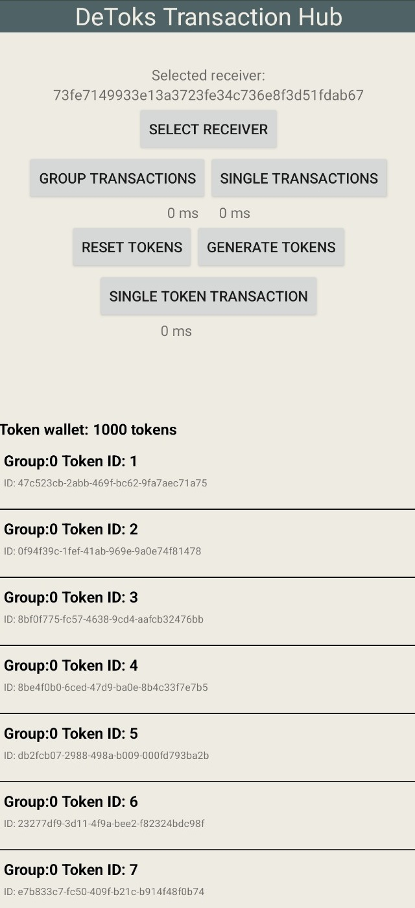
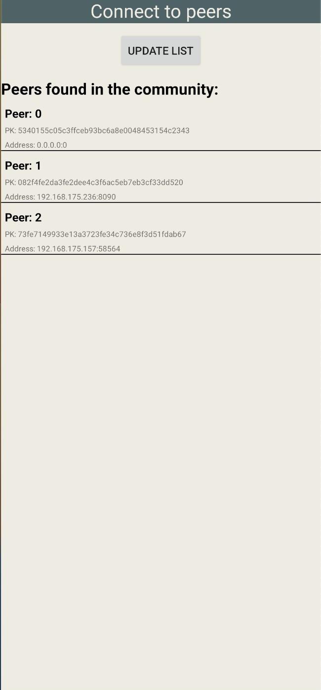

# Detoks Transaction Engine group III
/TODO INSERT DETOKS IMAGE

DeToks is an Android application built on top of [IPv8](https://github.com/Tribler/kotlin-ipv8), and is integrated into the [Trustchain Superapp](https://github.com/Tribler/trustchain-superapp). DeToks' purpose is to be a blockchain-based alternative version of Tiktok built from scratch. Our contribution was to build a Transaction engine API that allows to send multiple tokens through a single transaction to another peer and operate multiple transactions simultaneously to reduce the time needed to complete them. We also have benchmarks test the
This report is further divided into the following sections:
* **Design of DetoksTransactionEngine**: In this section we describe how we have structered the transaction engine, tokens, fragments and so forth. We additionaly describe our design choices in the development process.
* **API**: In this section we describe in details how to use the functions in the DetoksTransactionEngine for future works.
* **Benchmarks design and results**: In this section we present how we have designed our benchamrks and the results we have obtained.
* **Limitations encountered**: In this section we describe the limitations that we encountered while trying to optimizing the transaction engine, as well as what limitations our design choices have implied.
* **Future Works**: In this section we describe possible improvements that can optimize or extend our work.

## Table of Contents
- [DeToksTransactionEngine](#DetoksTransactionEngine)
    - [Table of Contents](#Table-of-contents)
    - [Project Structure](#Project-Structure)
    - [Transaction Engine](Transaction-Engine)
        - [Token Structure](#Token-Structure)
        - [Database design](#Database-design)
        - [UI](#UI)
        - [Transaction Engine Features](#Transaction-Engine-Features)
        - [Contrib proposal and agreement blocks over Trustchain](#Contrib-proposal-and-agreement-blocks-over-Trustchain)
        - [Design choices to group transactions](#Design-choices-to-group-transactions)
        - [Unit Tests](#Unit-Tests)
    - [API](#API)
        - [Single Transaction](#Single-Transaction)
        - [Multiple Transactions](#Multiple-Transactions)
        - [Receiving Proposal Blocks](#Receiving-Proposal-Blocks)
        - [Receiving Agreement Blocks](#Receiving-Agreement-Blocks)
    - [Benchmarks design and results](#Benchmarks-design-and-results)
        - [Benchmark Single Transaction](#Benchmark-Single-Transaction)
        - [Benchmark Grouped Transaction](#Benchmark-Grouped-Transaction)
        - [Optimized parts and bottlenecks](#Optimized-parts-and-bottlenecks)
    - [Limitations encountered](#Limitations-encountered)
        - [Trustchain limitations](#Trustchain-imitations)
        - [Coroutines for sending multiple single transactions](#Coroutines-for-sending-multiple-single-transactions)
        - [Coroutines for creating multiple blocks](#Coroutines-for-creating-multiple-blocks)
        - [Network Inconsistency](#Network-Inconsistency)
    - [Future works](#Future-works)
        - [Multiple blocks broadcasted at once](#Multiple-blocks-broadcasted-at-once)
        - [Remediation for lost packets](#Remediation-for-lost-packets)

## Project Structure
The project and code is split into the following three parts:
- `transactionEngine`: The transaction engine itself, which is a modular transaction engine that can be used in other projects or communities.
- `UI`: The UI of the transaction engine, consisting of the benchmark fragment and the peer connection fragment
- `util`: Utility classes and functions used in the transaction engine and the UI
- `test`: Unit tests for the transaction engine

// TODO - i wrote this cause its nice to have some kind of structure in our files, but this should still be implemented in the actual project

## Transaction Engine
In the context of the Detoks project, the transaction engine is a module that allows to send tokens to other peers. In doing so, peers should be able to freely use the DeToks app without any noticeable delay in the user experience.  This means that the transaction engine should be fast; transactions should happen in the background in orders of milliseconds, but also reliable; integrity should be maintained automatically while the service remains available.

The transaction engine presented in this report aims to  fulfill both of these points. It is a modular transaction engine built on top of the [IPv8](https://github.com/Tribler/kotlin-ipv8) network overlay.  To ensure integrity and validity, it builds upon the [TrustChain Community](https://github.com/Tribler/kotlin-ipv8/blob/master/doc/TrustChainCommunity.md).  One of the key features of TrustChain is its resistance to Sybil attacks, which occur when a malicious entity creates multiple identities to gain control over the network. Additionally, TrustChain offers retrospective validation and integrity through the use of tamper-proof, temporal ordered and cryptographically signed transaction records to create irrefutable proof of past interactions.

We extend on TrustchainCommunity, inheriting all of its properties, and adding the following features:
- **Multiple tokens in a single transaction**: The transaction engine allows to send multiple tokens in a single transaction to another peer.
- **Grouped transactions**: The transaction engine allows to group multiple transactions meant for the same peer, to improve performance.

### Token Structure
To realize our transaction engine, we have opted for the use of 'owned' virtual tokens as a way to dictate a users' balance instead of an integer balance. We have opted for this choice as this would, in future work, allow us to validate ownership of specific tokens through the TrustChain network. Unfortunately, due to limited availability of hardware, this was quite difficult for us to test, and therefore we opted to focus more on transaction efficiency _whilst keeping our design open to integrity validation in the future_. Since integrity validation of a transaction requires to crawl blocks from multiple peers and that was not the focus of our work, we leave that for future works.

As for the design of the token, we use a simple design; each token consists of a [UUID](https://docs.oracle.com/javase/7/docs/api/java/util/UUID.html) and an integer ID, of which the latter only functions for debugging. UUIDs are widely used as a method to create unique IDs for each object, which we use in the DeToks Transaction Engine as a way to identify a single token.

//TODO If kept akif older version, get rid of pk or add it here

### Database design
This choice in use of tokens required a local storage of tokens.  Each peer keeps track of their currently owned tokens in an SQLite dasending to selftabase. SQLite was opted for as it is a lightweight server-less relational database management system suitable for embedded systems such as phones.

To further increase token transaction efficiency, we aimed to keep the amount of database accesses to a minimum, as we found that database accesses were quite straining on runtime. To handle grouping of transactions more effficiently, we used [SQLite transactions](https://cashapp.github.io/sqldelight/2.0.0-alpha05/android_sqlite/transactions/). These transactions allow you to execute multiple statements under a single database transaction.

### UI
The UI consists of two fragments: the Benchmark Fragment and the Peer Connection Fragment.

The Benchmark Fragment, or the 'DeToks Transaction Hub', functions as a central hub to perform benchmarks.  To start off, a user can select the peer to which it wants to send tokens by pressing the 'select receiver' button.  This navigates the app to the other fragment; the Peer Connection Fragment.

This fragment scans the network for peers connected to the DeToksTransactionEngine, and automatically updates the list of available peers.  Upon pressing a listed peer, the user is prompted to confirm their desire to connect to this peer, returning the app to the Benchmark Fragment upon confirmation.

 

Once returned in the Benchmark  Fragment, the connected peer field will be updated, making us ready to send tokens. The list on the bottom of the screen denotes your current token wallet, showing each token found in your local database. This token list is automatically updated once a change to your wallet happens.

Furthermore, the Benchmark Fragment allows for various modes of sending, which are described below.

### Transaction Engine Features
Within the Benchmark fragment, as shown above, there are many UI elements to use and simultaneously benchmark the DeToks transaction engine. First of all, your token balance is shown in the aforementioned token list, which can be edited by either resetting your token balance or generating additional tokens with the two buttons above it.

Then, once tokens are available to be sent, the user can select the amount of tokens to be sent with the `benchmark-amount` selector. Additionally, the user can change the `grouping-amount` selector to change the amount of transactions grouped when using the **Grouped Transactions** mode of sending.

Once a peer is selected ([sending to self](#Sending-to-self) is also possible), tokens are available and the sending parameters have been set, the user can choose from three modes of sending:
- **A single transaction** - send a single token from your wallet to the selected peer.
- **Single Transactions** - sends an amount of single proposal blocks based on the selected `benchmark-amount`. Displays the amount of time taken to receive all agreements from the receiving peer below the button.
- **Grouped Transactions** - sends an amount (`benchmark-amount`) of grouped proposal blocks, with `x=grouping-amount` transactions grouped per proposal block.

After the full transaction benchmark has finished, e.g. the receiving peer has responded with an Agreement and the sending peer has processed all agreements, the benchmarked time is displayed beneath the button used to start the benchmark.

Additionally, we attempted two other methods of sending in order increase transaction throughput, both using coroutines. However, these two methods proved to be infeasible, of which a discussion can be found in the [limitations](#Limitations-encountered) section.

#### Sending to self
For debugging purposes, sending to yourself is also possible. This is your default selected peer; in case you do not select any other peer, you will send to yourself. In this case, UUIDs are regenerated each time you receive tokens from yourself to avoid duplicate ID errors in the local database.

### Contrib proposal and agreement blocks over Trustchain
We decided to develop our engine using the [TrustChain Community](https://github.com/Tribler/kotlin-ipv8/blob/master/doc/TrustChainCommunity.md) so that we can make transactions following the operation explained by [ConTrib: Universal and Decentralized Accounting in Shared-Resource Systems](https://dl.acm.org/doi/pdf/10.1145/3428662.3428789). In addition to the token database we have implemented, we also use a tamper-proof distributed ledger for each peer to maintain the blocks that make up the transactions. The half-block structure details can be found in the [TrustChain Community](https://github.com/Tribler/kotlin-ipv8/blob/master/doc/TrustChainCommunity.md). In our engine, we reuse the same logic implemented in the Trustchain community to perform transactions, adapting it to our token-based design.
A transaction between A and B is performed in the following way:
- First, A creates a proposal block containing as transaction a list of Tokens.
- A signs the proposal block, save it in its database, sends it to B and broadcasts it to the network. Other peers not involved in the transaction will just store the block.
-  Upon receiving the proposal block, B validates its integrity. If the block is valid and B agrees with the proposed transaction, B stores the tokens sent by A in its token database and it creates an agreement block, containing as transaction a list of the _unique ids_ of the tokens sent by A.
- B signs the agreement block and sends it back to A and broadcasts it to the network.
- Upon receiving the agreement block, A removes all the tokens that have the same _unique ids_ sent by A. After that, the transaction is considered to be completed.
### Design choices to group transactions
//TODO
### Unit Tests
We have implemented numerous unit tests, mainly to tests the IO-operations of our app. We attempted to create larger integration tests, but unfortunately, we found this to be impossible since this would require the hosting of virtual devices.
We have also implemented unit tests for token creations and operations within the token database.
// TODO - rework this
## API
the transaction engine is a module that allows to send tokens to other peers. Given that, here we present a detailed list of features our engine implements, describing how to use them and the use for which they are designated. Addtionaly to the functions described in this section that are specifically designed to handle token-based transactions, it is useful to notice that our transaction is based on [TrustChain Community](https://github.com/Tribler/kotlin-ipv8/blob/master/doc/TrustChainCommunity.md). Thus, it is possible to additionaly its functionality, such as custom listeners, half-blocks pair broadcasts and crawl requests and responses.
### Single Transaction
To send a list of tokens and create a transaction( and thus create a half-block proposal)to a selected peer, the function **sendTransactionSingle(tokenList: List<Token>, peer: Peer): TrustChainBlock** can be used.
 This function takes as parameters the list of tokens you want to send and the selected Peer and sends a proposal half-blocks containing the tokens as transaction. The tokens are not removed from the database until an agreement half-block sent by the selected peer is received.
### Multiple Transactions
To perform multiple transactions at once with a single peer, the function **sendTransactionGrouped(tokenList: List<Token>, peer: Peer): TrustChainBlock** can be used.
This function takes as parameters a list of tokens for every transaction that has to be performed, and the selected peer. The tokens involved in every transaction are not removed from the database until an agreement half-block sent by the selected peer is received. For further details on the performance comparison between the 2 functions above, refer to [Benchmarks design and results](#Benchmarks-design-and-results).
### Receiving Proposal Blocks
The functions **receiveSingleTransactionProposal(block: TrustChainBlock)** and **receiveGroupedTransactionProposal(block: TrustChainBlock)** process the incoming proposal half-blocks received, store the tokens collected from the blocks and create agreement half-blocks based on the proposal half-blocks received. These functions are used in the block listeners.
### Receiving Agreement Blocks
The functions **receiveSingleTransactionAgreement(block: TrustChainBlock)** and **receiveGroupedTransactionAgreement(block: TrustChainBlock)** process the incoming agreement half-blocks received, store the tokens collected from the blocks and create agreement half-blocks based on the proposal half-blocks received. These functions are used in the block listeners.
## Benchmarks design and results
//TODO
### Benchmark Single Transaction
//TODO
### Benchmark Grouped Transaction
in order to assess the performance of our app and to find the bottlenecks we generated flame graphs. Finding these bottlenecks are very helpful when trying to reduce execution time. The resulting flamegraph can be seen here:

## Limitations encountered
The development of the transaction engine following our implementation choices and design choices resulted in limitations that we had to deal with, such as the already developed frameworks we relied on in order to realize a working engine.
Below we detail the various problems we encountered, why we encountered them, some of the solutions we thought of to remedy them but that didn't work, and what partially helped to optimize the engine.
### Trustchain limitations
One of the most significant design choices was to use Trustchain community, and not the simpler community, in order to reuse the half-block architecture, creation, sending, storage, validation, and everything else it already implements. This provided interesting properties to our Engine, such as being Sybil-resistant, but also implied limitations in performance. The operations of the Trustchain community, with the features described above, introduce more time-consuming operations than simply sending an unencrypted token via the ipv8 overlay, and this in performance and benchmarks has greatly impacted the results.
### Coroutines for sending multiple single transactions
One approach we considered in trying to optimize the transaction engine was to use Kotlin's coroutines to perform multiple transactions in parallel by creating and sending multiple proposal half blocks simultaneously. This solution, after several attempts, was not chosen for two main reasons:
- During benchmarks using 1000 transactions, we noticed that sending 1000 packets simultaneously to a peer(received asynchronously), which simultaneously has to process them and send the corresponding agreement half-blocks, creates congestion and causes packet loss. This can consequently have a very significant impact on performance.
- The half-block structure includes a **sequence number**, the sequence number of the block in the chain of the initiator of the block, and a **previous hash**, the SHA256 hash of the previous block in the chain of the initiator of the block. The use of coroutines in some cases resulted in blocks that were created and sent at different times and that has invalidated the correct values of these two fields in the various blocks stored by the sender and by the receivers of the broadcast to the network.

### Coroutines for creating multiple blocks
To partially use the optimization thought in the [previous point](#Coroutines-for-sending-multiple-single-transactions), we thought of using coroutines only in creating the proposal half blocks simultaneously, and then sequentially validating, storing, and sending them in order not to congest the receiver's network. This introduced another problem, though: when creating all the half-blocks at the same time, they would have the same **sequence number** and **previous hash** of the latest block in the chain of the sender; their validation and storing would have invalidated and corrupted the chain.
### Network Inconsistency
The IPv8 overlay, while it made it easier to send messages, caused us some problems during the development of the engine. More specifically, in creating our community, we always found peer discovery, which is being able to locate other devices connected to the same community, inconsistent (a questo non abbiamo saputo dare rimedio). Plus, a few times we encountered packet loss in the network, which combined with the stateless UDP protocol that Trustchain uses, is not notified.

## Future Works
In this section we report some ideas that could be implemented in the future to improve the performance of the Engine and expand its functionality to apply it to different uses
### Remediation for lost packets
Although the choice to use the trustchain community to exchange tokens has greatly limited packet loss, if one wants to be certain of completing transactions one must keep in mind that both the proposal half-block and the agreement half-block could be lost. Creating new blocks containing the same transactions would place a new block into the network containing the same transaction as one already shared, in addition to having an incomplete half-block pair. The correct implementation of a mechanism to remedy packet-loss should not create half blocks again, but retrieve those already used and stored in the TrustStore and reexchange them with the targetPeer and the network, in order to properly complete the transaction and have the correct blocks.
### IPv8 messages or smart broadcast
The mechanism that Trustchain develops with the halfblocks including creation, signing, validation, storage, and sending requires a considerable amount of computation time. If you are aiming for a faster and quicker Engine without necessarily having the need for this process there are two main options:
- Use only the Ipv8 network and exchange tokens with a standard form of encryption, with the use of a simpler database that stores transactions made in the form [sender, receiver, tokens exchanged]
- Take advantage of the fact that proposal half-blocks are broadcasted to the network and include multiple proposal half-blocks addressed to multiple recipients in a single packet. A peer receiving this packet will later create agreement blocks only for the proposal half-blocks that have him as the target.
