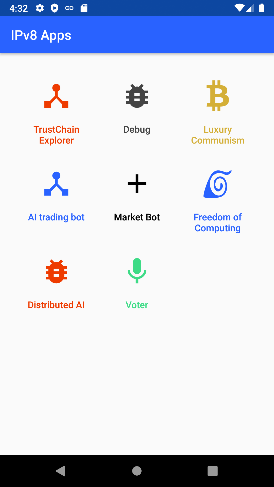
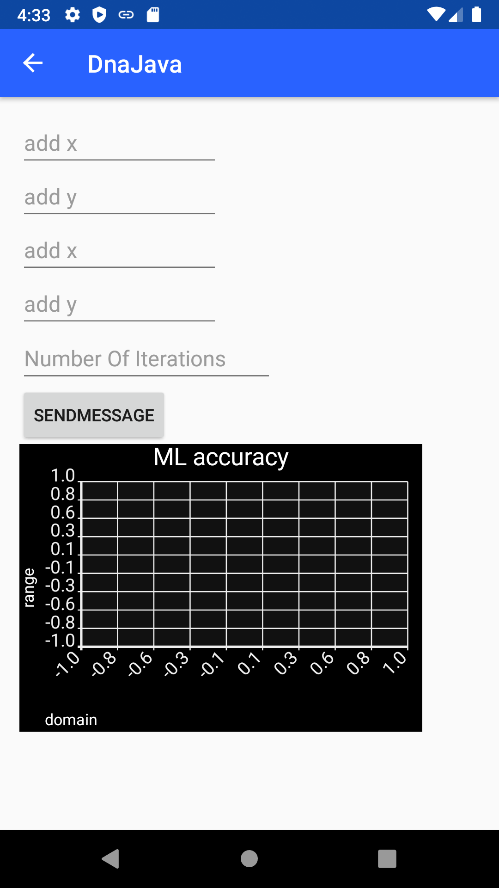

# Distributed-AI

Distributed-AI is an Android application built on top of [IPv8](https://github.com/Tribler/kotlin-ipv8)
and [Trustchain](https://github.com/Tribler/kotlin-ipv8/blob/master/doc/TrustChainCommunity.md),
 and is integrated into the [Trustchain Superapp](https://github.com/Tribler/trustchain-superapp).

It is a proof-of-concept of distributed, server less, machine learning. The base concept comes from
Róbert Ormándi from the University of Szeged (paper available [here](https://onlinelibrary.wiley.com/doi/abs/10.1002/cpe.2858)).

Unlike regular machine learning algorithms, which involves the data being present on a single computer,
this distributed machine learning algorithm is capable to learn, by analysing the data present on each
participating peer. The data never leaves the possessor, such that our algorithm could handle
sensitive personal information. Moreso, there is no single server learning a model from the data: every
participating peer has access to the learned model.

Our current implementation is far from finished. It takes numbers as input and performs a simple linear
regression. It isn't fully integrated with Trustchain's infrastructure, the data is still stored locally.
However, the algorithm performs our algorithm as if the data came from different sources, emulating
being server less.

**First Time Launch Screens**
 
  

