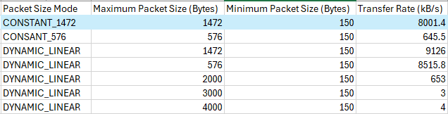
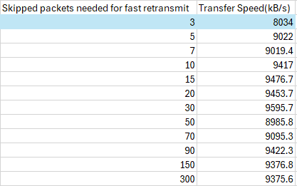
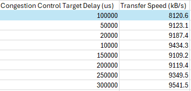
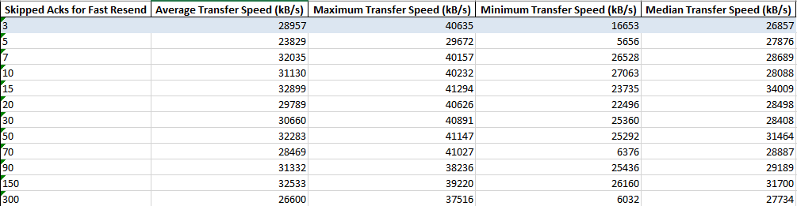
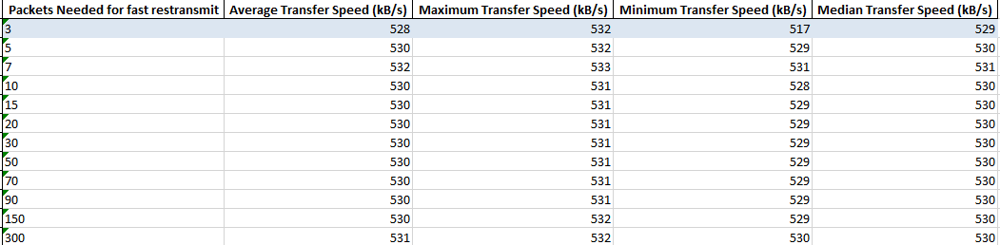
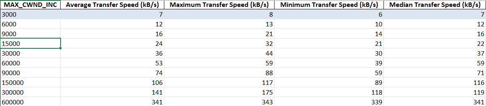
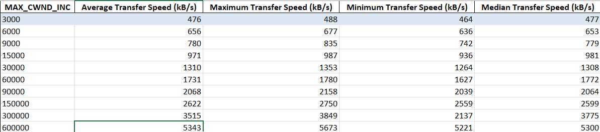
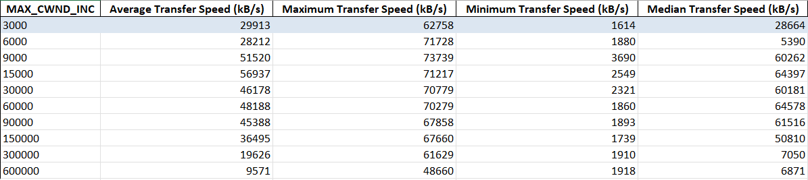
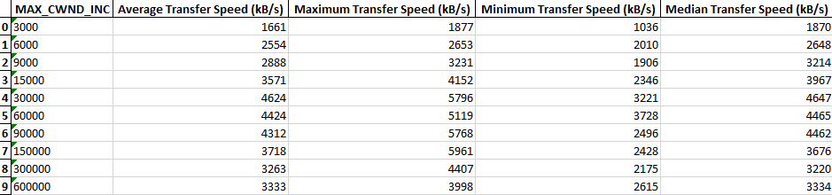

# Benchmarking
To see details on the benchmarking code, how to run it, its configuration, etc., see the [Benchmarking](https://github.com/PieterCarton/UTPBenchmark/tree/186d5a8a10a0e6afb857330ed2d96cdbaac05663).

    
Varying Package size/mode

     
    
Skipped packages needed before fast retransmit

     
    
Target Delay of Congestion Control

    

Test performed with 1% package loss under 250 ms latency, transfer speed taken as average of 10 runs.
[Benchmark Program Location](https://github.com/iiljkic/utp4j/blob/master/src/main/java/net/utp4j/examples/configtest/ConfigTestWrite.java)

- Implemented basic benchmarking "hand-shake": sending party in benchmark determines test plan to follow, receiving party follows plan
- Migrated benchmarking from docker to work on local machine
- Partially redid current benchmarks
  - Drastic improvement in performance compared to previous weeks when no latency is present (speeds of up to 50mB/s at its peak, avg. speed around 25mB/s)
  - Packet loss has little to no effect on these transfer rates
  - However, even small amount of latency makes the transfer rate collapse (50x decrease in speed at 50ms latency)
- Investigation of slow speed through wireshark
  - Transmitter only actively sending packets fraction of the time, then idle for multiple ms
  - Likely congestion window too small -> congestion control not optimally configured for medium to large latencies

    
Example: fast retransmission Benchmark without latency

     
    
Example: same fast retransmission Benchmark with 50ms latency

     

- Upon investigation of UTP with 500ms latency, congestion window was tiny as expected
- 2 issues found:
  - When connection is very stable, UTP estimates the variance of the latency to be 0ms. Since UTP uses the variance to determine when a packet times out, this leads to phantom packet loss and limits window size
  - When latency is very high (~500ms), the congestion window only increases very slowly. Upon investigation, congestion window growth is heavily dependent on Round Trip Time. Increasing the congestion window gain parameter greatly increases performance in the benchmarks
  - Max congestion window gain does not accurately represent window gain in practice, [there is factor 10 decrease in window gain](https://github.com/PieterCarton/utp4j/blob/7bd348b8ca849d6c4ab2327fdd4a22ed23082bcf/src/main/java/net/utp4j/channels/impl/alg/UtpAlgorithm.java#L223).
 
 
Benchmark results (performed on 4mB file):
(Default parameters coloured blue.)
(Benchmark script found [here](https://github.com/PieterCarton/UTPBenchmark/blob/186d5a8a10a0e6afb857330ed2d96cdbaac05663/benchmark.bash).)

    
At 500ms delay, with 10ms jitter and 1% pkt loss

     
    
At 50ms delay, with 2ms jitter and 1% pkt loss

     
    
At 0ms delay with 1% pkt loss

    

- We compared the UTP4J code to the [UTP specification](https://www.bittorrent.org/beps/bep_0029.html) and [LEDBAT specification](https://datatracker.ietf.org/doc/html/rfc6817#section-3.1), and it seemed to be up to specifications.
- Unit tests were created to verify correctness of UTP4j congestion control, where we test the effect of [latency caused by congestion](https://github.com/PieterCarton/utp4j/blob/master/src/test/java/net/utp4j/channels/impl/alg/LatencyFactorTest.java).
- Unit test were also made to test the packet time out behaviour.
- Some benchmarks were rerun with larger file sizes, effectiveness of boosting congestion window gain is decreased.

    
Example: Benchmark of transfer of 50mB file at 50ms latency

     

