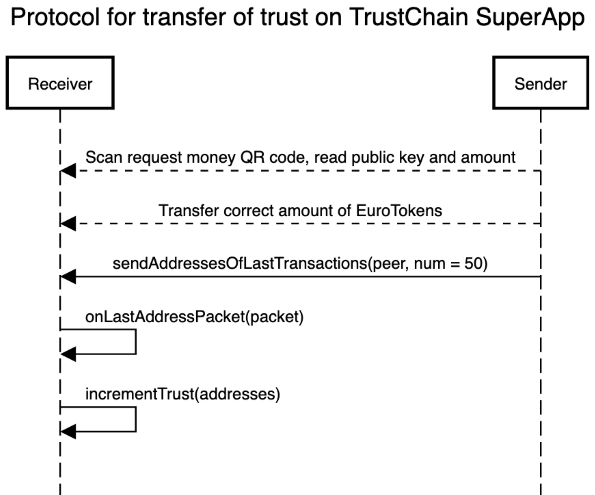
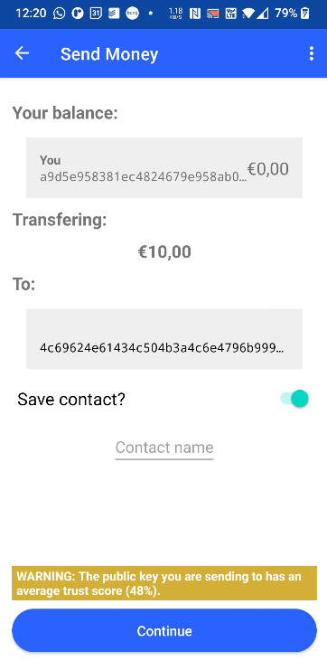

# EuroToken: Protocol specifics
Previously, the app had zero indication of whether the counterparty was to be trusted.
Our pull request attempts to create a 'web of trust' by transceiving public keys that counterparties transacted with in the past.

An unknown public key currently receives a trust score of 0.
Upon receiving a message containing a known public key, the trust score is incremented by 1 (up to 100).
The following sequence diagram describes the trust update protocol.
To transceive the list of 50 public keys, the EVA protocol is utilized.

## EVA protocol specifics

### Sending public keys
- As mentioned, we use the EVA protocol to transmit a binary blob of encoded public keys to the other party.
- `TransactionsPayload` serializes and deserializes _n_ public keys seperated by comma's into a correct payload.
- `serializePacket` is called to construct an encrypted pcket containing the payload and message identifier (MessageId.ATTACHMENT) such that only the counterparty can decrypt the message with it's private key.
- `evaSendBinary(peer, 'eva_last_addresses', payload.id, packet)` is called to finally transmit the binary.

### Receiving public keys
- Upon receiving a packet, the `messageHandlers` list is checked for matching handler calls in `nl.tudelft.trustchain.eurotoken/community/EuroTokenCommunity.kt`.
- MessageId.ATTACHMENT is matched to the last addresses packet and `onLastAddressPacket` is called.
- The packet is decrypted using `packet.getDecryptedAuthPayload`.
- `myTrustStore.incrementTrust(address)` is called for every  address found in the payload.

## Changelog
- Added `TrustStore.db` to store and update public key + trust score pairs.
- Added demo mode to EuroToken, which can be toggled on in the topright options corner. Demo mode is used to generate random keys for transmitting, in case when a fresh app has no transactions.
- Added transceiving of public keys. On receive; update trust score by 1 (default is 0). Send latest 50 transaction public keys after sending EuroTokens to someone.
- Added a visualization of the trust score of the counterparty you are transacting with. Check out `TrustScoresFragment.kt`
- Improved string localization; move strings to `eurotoken/src/main/res/values/strings.xml`
