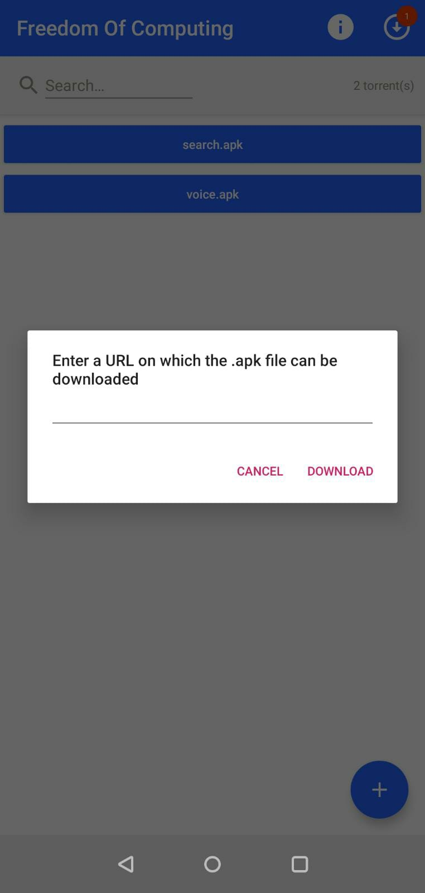
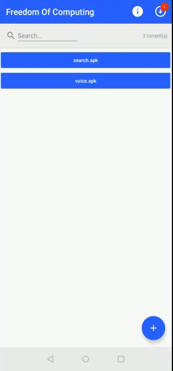
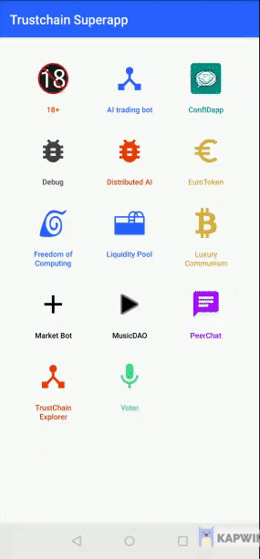
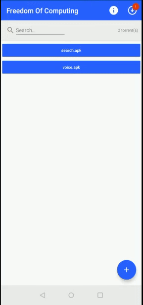
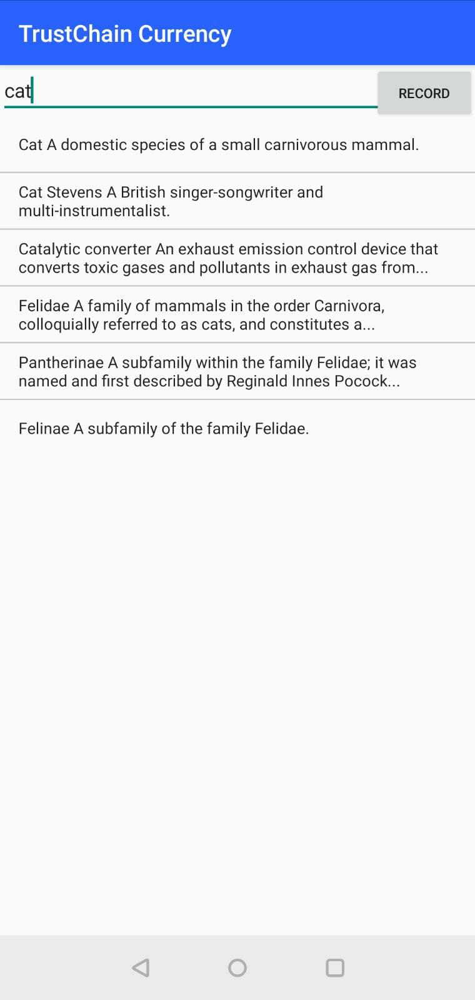

# Freedom-of-Computing App

## Overview
Freedom-of-Computing provides users with the ability to freely distribute and execute code in the form of APK applications on the trustchain superapp. In order to facilitate the sharing of applications, Freedom-of-Computing contains a gossiping mechanism which periodically shares local applications to other users and downloads unseen applications from other users. This sharing is conducted through a torrent peer-to-peer (P2P) network and uses the EVA Protocol as a fallback. Once the application has been downloaded by the users, they can dynamically load and execute it. The application, apart from being an .APK file, needs to have a specific format for the execution to work, the requirements/constraints are listed below.

## User Guide
We present the main use cases of our app, step by step, through which our contributions to the whole “superapp” project become visible.

### Creating a torrent out of an apk
The user has a .apk file they want to distribute to the rest of the peers in the superapp’s network, say “voice.apk”. Suppose this file resides on a publicly accessible location on the internet. The user presses the "+"-button on the main FOC screen and enters the URL on which the .apk is published. After confirming this URL, the .apk file will be downloaded into the superapp's app-specific directory and a new button will be displayed on the main FOC screen. By long-pressing/holding the newly appeared button, the user will be shown a set of options from which they can choose to either delete the file or create a torrent out of it. Once the torrent has been created, FOC will automatically share this with other FOC peers within the community.





### Downloading the seeding torrent, as a recipient
FOC continuously scans the network for newly seeded torrents, i.e. torrents it has not yet downloaded. If such a torrent is detected, it is directly downloaded to the app-specific directory of the superapp. Upon successfully downloading a detected torrent, FOC will create a torrent from the retrieved .apk on the receiving device to build a larger P2P network. The recipient will also be shown a new button displaying the name of the download .apk.



### Executing the downloaded apk
The user can press the displayed buttons containing the name of the specific .apk to execute it.



## Developer guide

### Main classes

The MainActivityFOC is the main class which boots FOC. From here, all UI is loaded and the AppGossiper, which performs all network communication, is initialized. Furthermore, MainActivityFOC is also responsible for booting the dynamic code execution by initializing ExecutionActivity.

The AppGossiper class is the main hub for all communication for both downloading and uploading .apks. For both uploading and downloading, threads are created. The uploading thread will, in its current configuration, inform all known peers about 5 of its randomly chosen locally stored torrents every 10 seconds using the EVA protocol. Note: the AppGossiper knows about locally stored torrents by considering all .torrent files in the superapp's app-specific directory. This also includes additional functionality where newly downloaded/added torrents will automatically be shared. The downloading thread is currently ran every 20 seconds and will attempt to download all torrents it knows about, but does not have stored locally. Initially, a torrenting mechanism will be used to share the .apk file with the receiver using a magnet link. However, in FOC's current state, this mechanism only works when both the sending and receiving device are connected to the same network and can thus communicate with each other directly. When attempting to share .apk's between devices on different networks, they will be unable to reach each other and will thus result in failure. The AppGossiper will attempt to retry the download until a threshold is reached, which is currently set to 1 failure. As soon as this threshold is reached, the receiving device will fallback to a different approach and attempt a download using the EVA protocol. If the latter method fails as well for a specific amount of times (currently set to 10), it will give up on this .apk file.

The ExecutionActivity is responsible for executing dynamic code. It is passed the name of an .apk file, which should be stored in the superapp's app-specific directory. The DexClassLoader is used to load the .apk into memory, after which FOC will search for a class called 'MainFragment', as this is used as the starting point to boot the loaded code. Furthermore, the ExecutionActivity class supports basic functionality for saving states of dynamically loaded code. As such, as soon as the instance of ExecutionActivity is paused, it will store the current (UI) state into a file named the same as the apk followed by a .dat extension. Upon re-initializing the dynamic code, FOC checks for existing saved states, after which such state will be restored.

### How to develop a module for execution in our app

#### Code and layout constraints
Our execution platform is currently only able to load fragments from an Android Package Kit(APK). Our platform loads one fixed fragment class from the APK to run inside of our platform's activity. The fragment that is loaded can still depend on other classes in different files inside of the APK.

Here are the constraints a developer needs to strictly follow to develop an app for execution in the Freedom of Computing execution platform:

* Our platform starts executing from the class named "com.execmodule._name of the APK_.MainFragment" so it is necessary to have this fragment as the entry point for the module

* As our platform internally uses DexClassLoader in order to load classes from an APK, it is really difficult to load precompiled layout resources from the APK. Therefore the developer needs to programatically build the layout instead of using XML files or pre compiled resources to build a UI.

Other than these constraints, a developer can follow the normal android development procedures for further functionalities.

### A "Hello World!" example
```java
package com.execmodule.helloworld;

import android.annotation.SuppressLint;
import android.os.Bundle;

import androidx.fragment.app.Fragment;

import android.util.Log;
import android.view.LayoutInflater;
import android.view.View;
import android.view.ViewGroup;
import android.widget.Button;
import android.widget.EditText;
import android.widget.LinearLayout;

public class MainFragment extends Fragment {

    public MainFragment() {
        // Required empty public constructor
    }
    public static MainFragment newInstance(String param1, String param2) {
        MainFragment fragment = new MainFragment();
        return fragment;
    }

    @Override
    public View onCreateView(LayoutInflater inflater, ViewGroup container,
                             Bundle savedInstanceState) {

        LinearLayout mylayout = new LinearLayout(container.getContext());
        LinearLayout.LayoutParams lp = new LinearLayout.LayoutParams(ViewGroup.LayoutParams.MATCH_PARENT, ViewGroup.LayoutParams.MATCH_PARENT);

        Button mybutton = new Button(container.getContext());
        mybutton.setText("hello world");
        mybutton.setId(2);
        mybutton.setLayoutParams(lp);
        mylayout.addView(mybutton);

        View view = mylayout;
        return view;
    }
}
```




**NOTE:** A more advanced example/demo can be found at: https://github.com/Tribler/trustchain-voice-search
