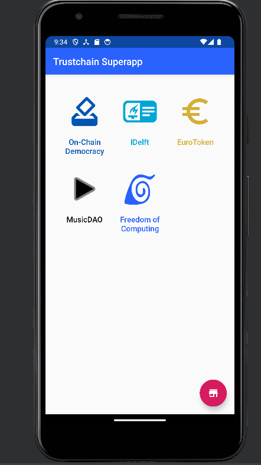
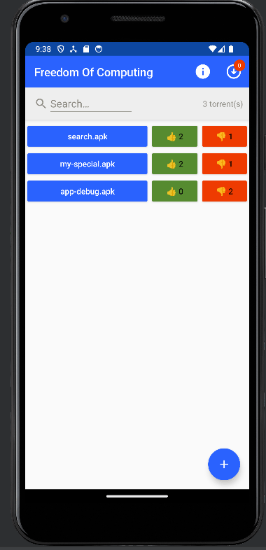
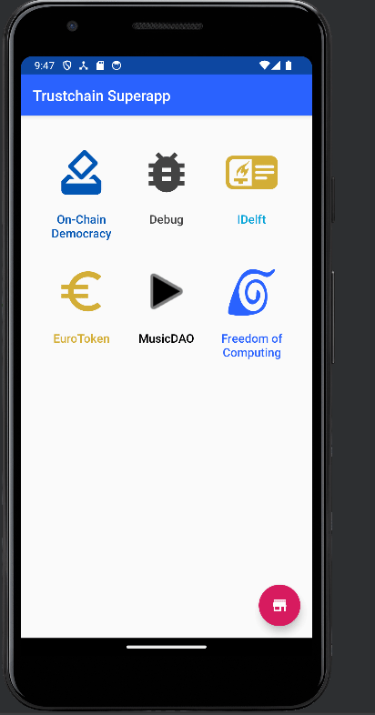

# Developer Onboarding Guide for FreedomOfComputing

This is a guide to help understand the FreedomOfComputing code base for new developers. We will
cover the main things you should be aware of, but more details can be found in the KDoc comments in
the code.

## MainActivityFOC

This is the class that contains the main logic for the FreedomOfComputing app, and contains the
logic from the main page of the app. The main methods of this class are `onCreate`, `onPause`,
`onResume` & `printToast`. For more information about the other methods, and the more complex logic
have a look at the KDoc comments at the top of each method.

As the name would indicate, `onCreate` is called when the class is first created which happens when
launching the FreedomOfComputing app. The main things this method does is add event listeners to
the different buttons & the search bar, loads the hardcoded `search.apk`, creates buttons for all
APKs and starts the [AppGossiper](#appgossiper).

The `onPause` method gets called everytime the user leaves the FreedomOfComputing main screen,
whether it be because they went back to the Superapp main screen, closed the app altogether, clicked
into an APK or opened a different app. This method is really useful to persist state between uses,
an example of this is how we store the votes that are in memory to a `.dat` file to ensure that
they're not forgotten the next time the user opens the app.

The `onResume` method is the opposite of that, in that it gets called when the user comes back to
the app. This can be used to restore the state that was stored in a file in memory, an example of
this is with votes. In this method we also make a call to [FOCCommunity](#foccommunity) to send out
a pull request to our peers to catch up on any votes that have been placed whilst we were offline.

The `printToast` method is useful for outputting visual text to the user. This can be used for
displaying error messages, or simply informing the user about some background activity that is being
done by the app.

## AppGossiper

The `AppGossiper` runs in the background when the user is on the main screen of the
FreedomOfComputing app. It continuously shares torrents with other peers and continuously checks for
APKs it can download from others. The main logic behind the sharing of the APKs is that the gossiper
will continuously call `randomlyShareFiles` with some delay between calls. Upon receiving a message
of type TORRENT inside of [FOCCommunity](#foccommunity) it will append this torrent to a list. This
list is then continuously checked in the `AppGossiper` (again with some delay in between calls), and
if there is a new APK it will then trigger the downloading of that APK. Naturally this means that
there is an inherent tradeoff between latency and unnecessary overhead when choosing the length of
the delays.

The `AppGossiper` doesn't actually contain the logic for exchanging messages with peers, or the
handlers for receiving a certain message from a peer. That logic lives inside of
[FOCCommunity](#foccommunity), which is injected in the `AppGossiper`.

## FOCVoteTracker

The `FOCVoteTracker` is an object which is responsible for keeping track of the current state of
votes. It keeps track of votes by storing a dictionary where the filename is the key, and the value
is a HashSet of [FOCSignedVotes](#focsignedvote). It is a singleton, which means we are able to
refer to it in several places but can't inject dependencies and as such a lot of the logic has to be
live outside of `FOCVoteTracker`. An example of that is the `placeVote` method in
[MainActivityFOC](#mainactivityfoc), which creates the actual vote object, signs it before calling
the `vote` method in `FOCVoteTracker` to actually keep track of the vote. Currently,
`FOCVoteTracker` is used inside of [MainActivityFOC](#mainactivityfoc) and inside of
[FOCCommunity](#foccommunity).

## Community

The community folder contains classes that are related to the community aspect of
FreedomOfComputing, meaning it contains classes used for communicating with other peers on the
network.

### FOCCommunityBase

This is an abstract class from which [FOCCommunity](#foccommunity) inherits, and is useful for unit
testing. In the `freedomOfComputing/src/test/java/nl/tudelft/trustchain/foc` folder there is
`FOCCommunityMock` class which inherits from `FOCCommunityBase` and is used for mocking in unit
tests.

### FOCCommunity

This is the class that contains the logic for communicating with peers. The different message types
are identified via their `MessageId` and in the `init` we register the different handlers for each
message type. Here is a concrete example of how this works: the `informAboutVote` method is called
from the inside the `placeVote` method in [MainActivityFOC](#mainactivityfoc), and sends an
[FOCVoteMessage](#focvotemessage) to some randomly selected peers. The `FOCCommunity` class for
these peers then receives this message and is handled by the `onVoteMessage` method, which gets the
payload of the message and uses it to update the votes in [FOCVoteTracker](#focvotetracker) as well
as on the UI. It also then relays this message if the `TTL` (time to live) is greater than 0.

### FOCVote

The `FOCVote` data class contains two fields, the member id of the user that placed the vote and a
boolean indicating the direction of the vote (Up/Down).

### FOCSignedVote

The `FOCSignedVote` class is contains the vote of type [FOCVote](#focvote) as well as the signature
and the public key which can be used to verify the authenticity of the signature. This is the type
that is stored inside of the [FOCVoteTracker](#focvotetracker) and is also gossiped to peers.

### FOCVoteMessage

The `FOCVoteMessage` data class is the payload that is sent to peers to communicate a vote being
placed. It contains the `fileName` of the APK on which the vote is placed, the
[FOCSignedVote](#focsignedvote) that is being placed and a `TTL` (time to live) which is initialized
to 2. The `TTL` sets how many times this vote should be forwarded.

### FOCPullRequestMessage

The `FOCPullRequestMessage` is the message that is sent out when rejoining the network. In this
message we include the ids of all the votes we know about, so that our neighbours can then know
which votes they have that we don't have. They will then respond with a
[FOCPullVoteMessage](#focpullvotemessage).

### FOCPullVoteMessage

The `FOCPullVoteMessage` data class is the message type that is sent back after doing a pull request
`onResume`. This message contains all the votes that our peer knows about which we don't know about.
If we're a first time user this can be quite a large message and so it makes use of the `EVA`
protocol, which is the same protocol used for gossiping APKs. If there are no votes that we're
missing, then this message will be empty.

## res

The res folder is located inside `freedomOfComputing/src/main` and contains a lot of `.xml` files
which are used for the UI of the FreedomOfComputing app inside the `drawable` & `layout`
sub-folders. The `raw` subfolder also contains `search.apk` which is the hardcoded APK that is
available on startup of the FreedomOfComputing app. The `values` subfolder contains `strings.xml`
which is where a lot of the hardcoded strings that are needed for buttons are defined. An example of
how this works is with the `createAlertDialogTitle` that it defines and is used in the
`createAlertDialog` method in [FOCMainActivity](#mainactivityfoc) to set the dialog title.

# User Guide

We present the main use cases of our app, step by step, through which our contributions to the whole “superapp” project become visible.

The user has a .apk file they want to distribute to the rest of the peers in the superapp’s network, say “my-special.apk”.
Suppose this file resides in a publicly accessible location on the internet. The user presses the "+"-button on the main FOC screen
and enters the URL on which the .apk is published. After confirming this URL, the .apk file will be downloaded into the
superapp's app-specific directory and a new button will be displayed on the main FOC screen. By long-pressing/holding the newly appeared button, 
the user will be shown a set of options from which they can choose to either delete the file, create
a torrent out of it, or vote on the apk. Once the torrent has been created, FOC will automatically share this with other FOC peers
within the community.

## Executing the downloaded apk

The user can press the displayed buttons containing the name of the specific .apk to execute it. In
order to execute it, the apk must be fully downloaded (when the apk is highlighted blue).

## Voting System

A new component to the FOC superapp is the voting system. When a user first joins the FOC community,
or opens the FOC community screen , they make a pull request to the other peers in the community
asking for votes on apks it does not have. It does this through the EVA protocol. The user sends a
list of vote ids that it has to its peers. The peers then do a check between their local vote
storage and the incoming storage. Votes that do not intersect are then gossiped to the user and is
consequently updated in the user interface. The gif below displays the first time a new user joins
the FOC community. The default search.apk is already loaded in but the two new apks with their
associated votes have been gossiped.

While a user engages with the FOC community app and peers are casting votes for APKs, new votes are
delivered to the user through "hot potato" gossiping. Here messages are relayed at most 2 times, and
are communicated to a log(n) number of neighbours. The GIF below demonstrates the upvote counter of
the app.debug.apk increasing by one, facilitated by a push-based gossip from another peer.

Once an apk reaches a certain threshold of positive votes (# of upvotes - # of downvotes), the apk
will be moved to the user's homescreen and they can execute the apk on the homescreen as well. The
gif below displays this happening with a threshold of three votes. 
This is done by storing it in the preference store of the app submodule. 
Then the home screen whenever it launches reads what apps are installed and places these on the home screen.
For more information on how this works we recommend to look at the following two files:
* `app/src/main/java/nl/tudelft/trustchain/app/AppLoader.kt`
* `common/src/main/java/nl/tudelft/trustchain/common/freedomOfComputing/InstalledApps.kt`

# Concluding our Project

The goal of our project was to have a voting system in place for APKs so that users could decide
which apps to try out and potentially install. We not only achieved that, but also did so in a way
that can be built upon in future projects. We made sure to document our code, through this README
amongst other things, and also added documentation for parts of the system that we didn't implement
in order to facilitate onboarding for future teams. We also made sure to write unit tests for our
code to minimize bugs.

## Testing and coverage

The new classes with heavy logic that required testing were `FOCVoteTracker` and `FOCSignedVote`
class. For the `FOCVoteTracker` class, we reached 100% method coverage with 90% of lines covered
(The missing lines are just mainly console log statements used for debugging) and on
the `FOCSignedVote` class, we reached 100% method coverage and 100% line coverage.

We've made sure to include detailed KDocs for all new and most existing methods. These documents
cover parameters, return statements, and provide an overview of each method's functionality.

## Key Decisions

One key decision we made in this project was how to gossip votes. Our first idea was that we could
periodically gossip all the votes we knew about. Whilst this was a good starting point it was not a
very efficient way of gossiping votes and didn't scale well. So after several iterations of
improvements focusing on reducing the latency and message size, we developed the current gossiping
protocol which is comprised of a push protocol and a pull protocol.

The push gossip happens when a user places a vote, and tries to inform other users that are
currently connected of this vote. To do this we decided to use a Hot Potato gossip where the
time-to-live (TTL) is hardcoded to 2. This is to avoid the same votes being gossiped around
continuously, whilst also making sure that we're informed about votes from peers with which we
aren't directly connected. This parameter may have to be tuned as the network grows. We also only
inform log(n) of our direct neighbors about this vote, in order to prevent flooding the network
completely and ensuring the scalability of this system.

The second gossiping protocol we have uses a pull-based approach. This is triggered when a user
joins the network and wants to be informed about votes they've missed. Originally we made it so that
all peers would respond with all the votes they knew about. Whilst this was simpler, it wasn't very
scalable and it is fair to assume that a lot of votes would be repeated. As a result, we decided to
include the ids of the votes we already knew on the request so that each peer would only respond
with the votes we're missing. This would mean that the requests would be slightly larger but this
should scale better, as all the responses will be significantly smaller when we have some prior
votes.

## Current Limitations

One of the limitations with our current system is that the size of the messages exchanged for
communicating votes is rather large. This is especially the case for the pull-based gossiping where
when we're just 8 votes behind the response takes 2376 Bytes. This might not seem like much, but
considering that we currently ask all our neighbours as part of the pull-based gossiping protocol
this could become problematic if there are a lot of votes placed. In the scenario where there are
millions of votes and which a first time has to catch up on whilst using mobile data, it could see
them burn through their monthly allocation at once. Potential solutions could include: reducing the
message size, catching up on votes gradually over time by iteratively asking peers and/or limiting
the number of neighbours we query upon joining the network.

Another limitation also relates to the scalability of the voting system. Currently `FOCVoteTracker`
stores votes in a dictionary which is kept in memory and only stored to file `onPause`, which could
be problematic if there are millions of votes placed. In such a scenario it may be better to use
some sort of local database such as [SQLite](https://www.sqlite.org) for example.

## Future Work

Besides addressing the current limitations listed above, here are some other features/improvements
that we think would be good to implement in the future.

One potential area for future improvement involves enhancing the pull-based gossiping mechanism.
As mentioned earlier, the current approach utilizes IDs to transmit requests, with the response
comprising a collection of new vote messages. There's potential to decrease message size by
employing short IDs (short unique IDs), and even more significantly, by incorporating set
reconciliation. This technique enables smaller message sizes and enhances scalability for
accommodating a larger number of votes.

Another prospective for future work involves enabling the removal of APKs that have been
automatically installed on users' home screens. This functionality can be implemented either
manually by the user or automatically if an APK no longer meets the required vote threshold.
