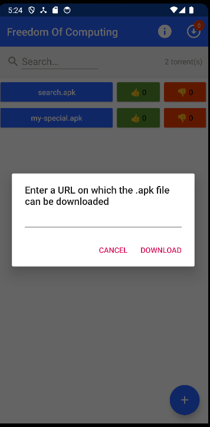
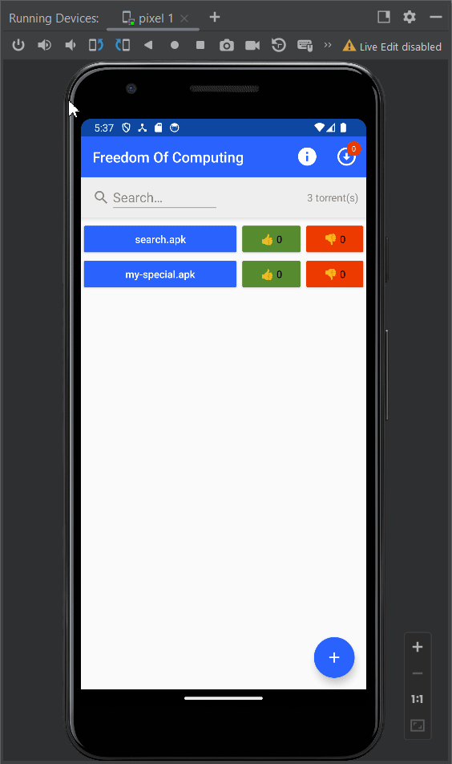
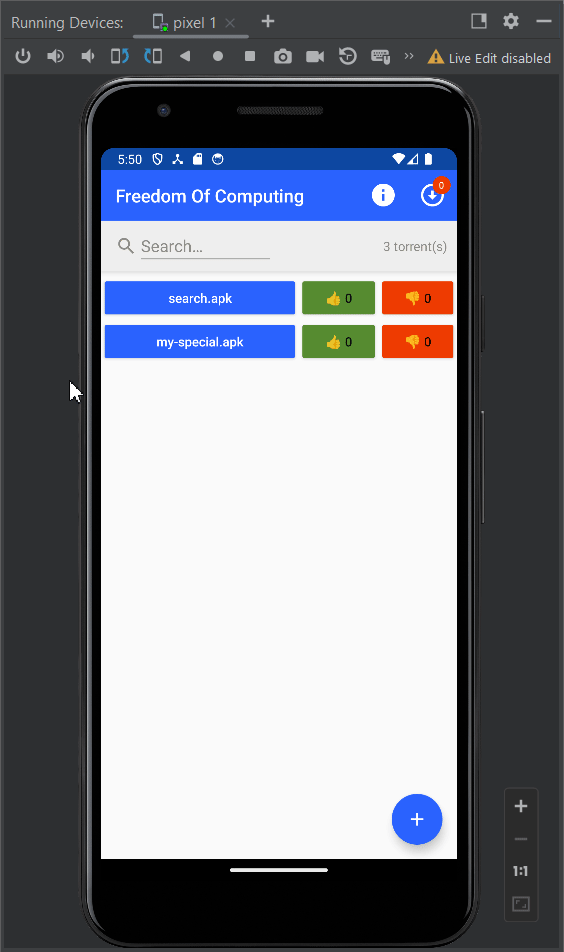

# Developer Onboarding Guide for FreedomOfComputing

This is a guide to help understand the FreedomOfComputing code base for new developers. We will
cover the main things you should be aware of, but more details can be found in the KDoc comments in
the code.

## MainActivityFOC

This is the class that contains the main logic for the FreedomOfComputing app, and contains the
logic from the main page of the app. The main methods of this class are `onCreate`, `onPause`,
`onResume` & `printToast`. For more information about the other methods, and the more complex logic
have a look at the KDoc comments at the top of each method.

As the name would indicate, `onCreate` is called when the class is first created which happens when
launching the FreedomOfComputing app. The main things this method does is add event listeners to
the different buttons & the search bar, loads the hardcoded `search.apk`, creates buttons for all
APKs and starts the [AppGossiper](#appgossiper).

The `onPause` method gets called everytime the user leaves the FreedomOfComputing main screen,
whether it be because they went back to the Superapp main screen, closed the app altogether, clicked
into an APK or opened a different app. This method is really useful to persist state between uses,
an example of this is how we store the votes that are in memory to a `.dat` file to ensure that
they're not forgotten the next time the user opens the app.

The `onResume` method is the opposite of that, in that it gets called when the user comes back to
the app. This can be used to restore the state that was stored in a file in memory, an example of
this is with votes. In this method we also make a call to [FOCCommunity](#foccommunity) to send out
a pull request to our peers to catch up on any votes that have been placed whilst we were offline.

The `printToast` method is useful for outputting visual text to the user. This can be used for
displaying error messages, or simply informing the user about some background activity that is being
done by the app.

## AppGossiper

The `AppGossiper` runs in the background when the user is on the main screen of the
FreedomOfComputing app. It continuously shares torrents with other peers and continuously checks for
APKs it can download from others. The main logic behind the sharing of the APKs is that the gossiper
will continuously call `randomlyShareFiles` with some delay between calls. Upon receiving a message
of type TORRENT inside of [FOCCommunity](#foccommunity) it will append this torrent to a list. This
list is then continuously checked in the `AppGossiper` (again with some delay in between calls), and
if there is a new APK it will then trigger the downloading of that APK. Naturally this means that
there is an inherent tradeoff between latency and unnecessary overhead when choosing the length of
the delays.

The `AppGossiper` doesn't actually contain the logic for exchanging messages with peers, or the
handlers for receiving a certain message from a peer. That logic lives inside of
[FOCCommunity](#foccommunity), which is injected in the `AppGossiper`.

## FOCVoteTracker

The `FOCVoteTracker` is an object which is responsible for keeping track of the current state of
votes. It keeps track of votes by storing a dictionary where the filename is the key, and the value
is a HashSet of [FOCSignedVotes](#focsignedvote). It is a singleton, which means we are able to
refer to it in several places but can't inject dependencies and as such a lot of the logic has to be
live outside of `FOCVoteTracker`. An example of that is the `placeVote` method in
[MainActivityFOC](#mainactivityfoc), which creates the actual vote object, signs it before calling
the `vote` method in `FOCVoteTracker` to actually keep track of the vote. Currently,
`FOCVoteTracker` is used inside of [MainActivityFOC](#mainactivityfoc) and inside of
[FOCCommunity](#foccommunity).

## Community

The community folder contains classes that are related to the community aspect of
FreedomOfComputing, meaning it contains classes used for communicating with other peers on the
network.

### FOCCommunityBase

This is an abstract class from which [FOCCommunity](#foccommunity) inherits, and is useful for unit
testing. In the `freedomOfComputing/src/test/java/nl/tudelft/trustchain/foc` folder there is
`FOCCommunityMock` class which inherits from `FOCCommunityBase` and is used for mocking in unit
tests.

### FOCCommunity

This is the class that contains the logic for communicating with peers. The different message types
are identified via their `MessageId` and in the `init` we register the different handlers for each
message type. Here is a concrete example of how this works: the `informAboutVote` method is called
from the inside the `placeVote` method in [MainActivityFOC](#mainactivityfoc), and sends an
[FOCVoteMessage](#focvotemessage) to some randomly selected peers. The `FOCCommunity` class for
these peers then receives this message and is handled by the `onVoteMessage` method, which gets the
payload of the message and uses it to update the votes in [FOCVoteTracker](#focvotetracker) as well
as on the UI. It also then relays this message if the `TTL` (time to live) is greater than 0.

### FOCVote

The `FOCVote` data class contains two fields, the member id of the user that placed the vote and a
boolean indicating the direction of the vote (Up/Down).

### FOCSignedVote

The `FOCSignedVote` class is contains the vote of type [FOCVote](#focvote) as well as the signature
and the public key which can be used to verify the authenticity of the signature. This is the type
that is stored inside of the [FOCVoteTracker](#focvotetracker) and is also gossiped to peers.

### FOCVoteMessage

The `FOCVoteMessage` data class is the payload that is sent to peers to communicate a vote being
placed. It contains the `fileName` of the APK on which the vote is placed, the
[FOCSignedVote](#focsignedvote) that is being placed and a `TTL` (time to live) which is initialized
to 2. The `TTL` sets how many times this vote should be forwarded.

### FOCPullVoteMessage
# todo (change)
The `FOCPullVoteMessage` data class is the message type that is sent back after doing a pull request
`onResume`. This message contains all the votes that our peer knows about and as such results in a
rather big message. This means that it can't be sent using the same protocol as the other message
types and instead has to make use of the `EVA` protocol, which is also the protocol used for sending
APKs to peers.

## res

The res folder is located inside `freedomOfComputing/src/main` and contains a lot of `.xml` files
which are used for the UI of the FreedomOfComputing app inside the `drawable` & `layout`
sub-folders. The `raw` subfolder also contains `search.apk` which is the hardcoded APK that is
available on startup of the FreedomOfComputing app. The `values` subfolder contains `strings.xml`
which is where a lot of the hardcoded strings that are needed for buttons are defined. An example of
how this works is with the `createAlertDialogTitle` that it defines and is used in the
`createAlertDialog` method in [FOCMainActivity](#mainactivityfoc) to set the dialog title.

## User Guide
We present the main use cases of our app, step by step, through which our contributions to the whole “superapp” project become visible.

The user has a .apk file they want to distribute to the rest of the peers in the superapp’s network, say “my-special.apk”.
Suppose this file resides in a publicly accessible location on the internet. The user presses the "+"-button on the main FOC screen
and enters the URL on which the .apk is published. After confirming this URL, the .apk file will be downloaded into the
superapp's app-specific directory and a new button will be displayed on the main FOC screen. By long-pressing/holding the newly appeared button, 
the user will be shown a set of options from which they can choose to either delete the file, create
a torrent out of it, or vote on the apk. Once the torrent has been created, FOC will automatically share this with other FOC peers
within the community.

### Downloading the seeding torrent, as a recipient
# todo 

### Executing the downloaded apk

The user can press the displayed buttons containing the name of the specific .apk to execute it.

### Voting 
# todo 

### Voting Gossiping 
# todo (push based and pull based)

