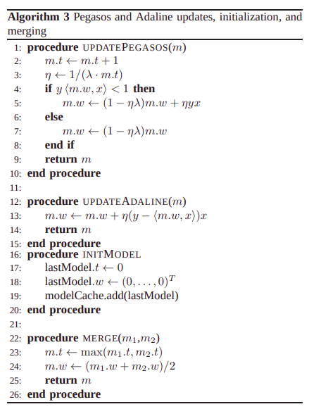
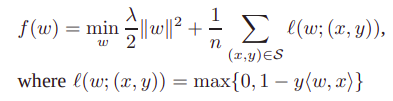
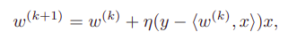

# Federated machine learning module for privacy-preserving music recommendations via gossiping

This repository contains a collection of Online models built on top of [IPv8](https://github.com/MattSkala/kotlin-ipv8)

**First Time Launch Screens**

Every time a user open music dao, they are asked to realod the page in order to get recommendations. This is done with the sole purpose of getting recommendations on request and avoid recommending meaningless data when there is a lack of local songs (training data).
 

**Recommendations**

 

**Overview**

Recommender community yields 2 recommendations made by 2 different models. In general, federated machine learning library has 2 types of model: feature-based models and collaborative filtering models, so recommendations are given one per each model type.
Collaborative filtering models include 1 model so far: a Matrix Factorization Model from [this paper](https://dmle.iais.fraunhofer.de/papers/hegedus2019decentralized.pdf)
Feature-based models include 2 models from the [following paper](https://arxiv.org/pdf/1109.1396.pdf): Adaline and Pegasos.
In addition, [Essentia library](https://essentia.upf.edu/) is incorporated in this library so that around 225 distict music features can be extracted from songs and used as training data.

All peers in the network have their own local model instances for both model types. On top of that, peers gossip models and features around the network.
Local (Essentia) features are gossiped among peers in order to have features for recommendations ('unseen' songs). As a 'backup' features, trustchain transaction data as song year or genere are used (if exist).
Models do random walk around the network and at each peer they are merged and re-trained on peer's local data.

**Model Background**

***Feature-based models***

Adaline (Adaptive Linear Neuron) is a single layer neural network that uses continuous predicted values from the net input.
Due to the use of continuous predicted labels taken before activation function, Adaline is capable of measuring the extent by which predictions were right/wrong.

Pegasos (Primal Estimated sub-gradient solver for SVM) - sub-gradient descent algorithm for solving optimization problems cast by support vector machines.

Pseudocode for Pegasos and Adaline models is shown below:
 

More formally, learning rule for Pegasos is defined as:

And learning rule for Adaline is defined as:

**Model performance**

So far, MatrixFactorization model showed to be pretty reliable on example tests. Unfortunatelly, feature-based models still lack proper pre-training/fine-tuning.
We have cherry-picked Essentia features that seem to be most distinct for example test albums in 'src/test/res' folder.
Nevertheless, prediction are not able to achieve high accuracy and we lack user preference data in order to propelry group music data and tune the models.
One thing that we have observed during testing is that upon merging global walking models with local models, local models weights get screwed if final weight ration is 1:1 for old local weight and global model weights.
Thus, contrary to the paper, we bag 2 models with ration 9:1 (9 for local model) in order to keep local models tuned to local data.

Essentia feature statistics for test albums in src/test/res can be found under docs/etc.
