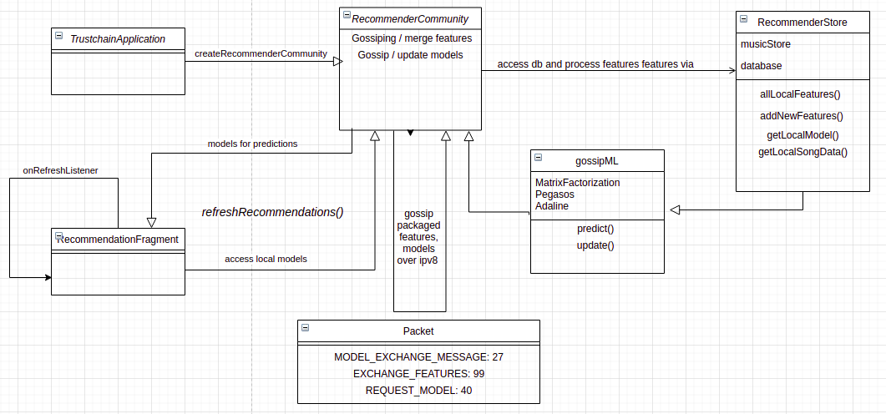
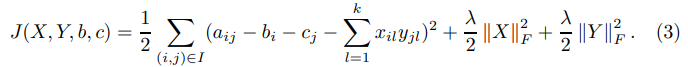
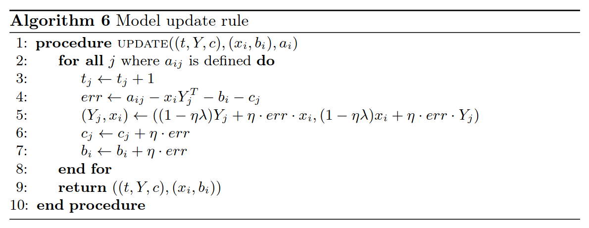
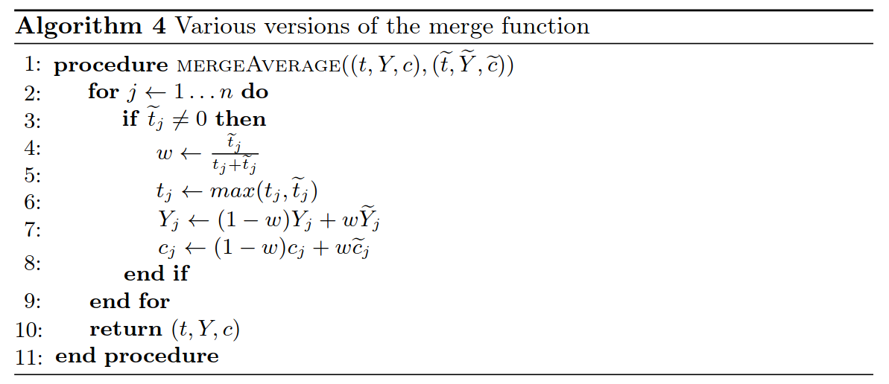

# Federated, privacy-preserving music recommendations via gossiping

This module contains a collection of recommendation models built on top of [IPv8](https://github.com/MattSkala/kotlin-ipv8)

Every time a user opens MusicDAO, they are asked to reload the page in order to get recommendations. This is done with the purpose of getting recommendations on request and avoid recommending meaningless data when there is a lack of local songs (training data).
 

## Overview

The recommendation engine yields two recommendations made by two different models: a musical feature-based model and a collaborative filtering model.
The idea is that the two models will capture different aspects in the patterns of a user's musical preference and so provide distinct recommendations.

The collaborative filtering model is based on federated matrix factorization as introduced in [this paper](https://dmle.iais.fraunhofer.de/papers/hegedus2019decentralized.pdf).
The feature-based models are from this [paper](https://arxiv.org/pdf/1109.1396.pdf), called Adaline and Pegasos.
These models are trained on audio features extracted from music files with the [Essentia library](https://essentia.upf.edu/).

All peers in the network have their own local model instances for both model types.
The local models are fine-tuned before making predictions to be personalized to a user's listening history.
Peers gossip models and features around the network to increase the predictive performance for everyone.
This is done in such a way that no private user data (listening history) is ever exchanged with peers.

Local Essentia features are also gossiped among peers in order to have features for recommendations of 'unseen' songs.
This also prevents duplicate work, as the Essentia features are relatively costly to calculate on mobile phones.

The two recommendation models follow slightly different gossiping strategies (according to the algorithms described in their respective papers / sections below). The figure below gives an overview of each model's propagation through the network.

The feature-based models are gossiped along random walks through the network. At each peer they are merged and re-trained on peer's local data.

The matrix factorization model seeks to learn a factorization of the user-song matrix. This means that one of the two factors contains only information on how users generally rate each song. This matrix can then be gossiped around the network while a user's personal vector as well as their listening history are kept private.

## Module structure

The general structure of the `gossipML` module can be seen below. The RecommenderCommunity is responsible for communications between peers. The RecommenderStore handles local data operations and preprocessing (audio features, model weights, listening history, etc.). The models are actually executed from the RecommendationFragment, which is in charge of user interaction with the UI.

## Model details

### Feature-based models

Adaline (ADAptive LInear NEuron) is a single layer neural network that uses continuous predicted values from the net input.
Due to the use of continuous predicted labels taken before activation function, Adaline is capable of measuring the extent by which predictions were right/wrong.

Pegasos (Primal Estimated sub-Gradient SOlver for SVM) is a sub-gradient descent algorithm for solving optimization problems cast by support vector machines. This is the feature-based model in use in the network.

Pseudocode for Pegasos and Adaline models is shown below:

More formally, learning rule for Pegasos is defined as:

And learning rule for Adaline is defined as:

### Collaborative filtering models

Matrix Factorization model is collaborative filtering model that bases recommendations on private logs of user activity (song history) by means of low-rank matrix decomposition.
In the private model, every matrix row corresponds to some user private information on music history.
This private matrix is then approximatelly decomposed into  matrices, X and Y, with Y shared among the users.

The general error that the model tries to minimize is:
,
where the bias (c and b) represent the overall average score of the given user/song, and X and Y represent relative differences.

Below is the pseudocode for the update rule corresponding to the above loss function:

Merging of gossiped models and local models happens via age-weighted averaging. This gives more weight to rows of the song factor matrix which have been updated more often (and so are probably more robust overall).

## Model performance

So far, the MatrixFactorization model showed to be pretty reliable on example tests.

Unfortunatelly, the feature-based models still lack proper pre-training/fine-tuning.
We have selected Essentia features that most distinctly separated a set of example albums (the features of which can be found in the 'superapp-essentia/test/res' folder).
Nevertheless, prediction are not able to achieve high accuracy and we lack user preference data in order to properly group music data and tune the models.

One thing that we have observed during testing is that upon merging the global walking model, local models weights were being overpowered when using a 50-50 weighting.
Thus, contrary to the paper, we average two models with 90% local model and only 10% walking model in order to keep local models tuned to local data.
In our case, we are not interested in one global model that can predict likes for everyone, but rather many local ones which are informed of useful feature representations by the global model.