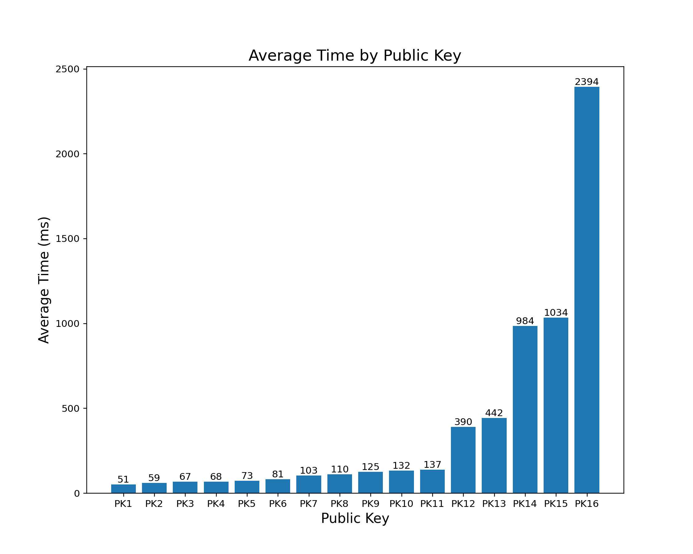

# DeToks: Upvote Token

DeToks is a decentralized TikTok skeleton application where several different groups implemented parts of the application. The application will utilize a peer-to-peer network consisting strictly of smartphones only. Currently, the application only works on Android-powered smartphones. The focus of this application will be the token economy, Torrent-based streaming videos, and basic app logic. Our responsibility for the project was the Upvote Token, and we will explain the components of this functionality in this README.

We will also show screenshots of the actions which are possible in our implementation:

- TODO: When implementation is finalized

## Table of Contents

- [DeToks: Upvote Token](#detoks--upvote-token)
  * [Table of Contents](#table-of-contents)
  * [Project Structure](#project-structure)
  * [Design Choices](#design-choices)
    + [TrustChain](#trustchain)
    + [Tokenomics](#tokenomics)
  * [Benchmarking](#benchmarking)
  * [Known Issues and Limitations](#known-issues-and-limitations)
  * [Future Work](#future-work)

This document will contain the project structure, design choices we made for our upvote token economy,
the underlying protocol used for our upvoting token, and the known issues and limitations.
Finally, we will also discuss the potential future work of the upvote token implementation.

## Project Structure

The project has been forked from the original DeToks application as to not have compilation issues later when the project is finished and all other groups merge their project to the main DeToks application. The project is composed of a few packages and files, which the most important ones are:

- ``community`` - This package contains the ``UpvoteCommunity`` which handles the Trustchain part of the protocol and calls relevant recommendation and upvoting code. Furthermore, it also contains the serializer and deserializer of the ``MagnetURIPayload``, ``RecommendedVideoPayload``, and ``UpvoteTokenPayload``
- ``token`` - This package contains the ``ProposalToken`` and ``UpvoteToken``. These contains the most important block creation logic for upvoting content (minting tokens) and also for the proposal block which is created everytime a peer posts a video. 
- ``trustchain`` - This package contains the logic ``Balance`` to check for the daily balance of each peer in the network without having to go through the entire Trustchain blockchain. It also contains a way to check a user's token balance. 
- ``TorrentManager`` - This file contains the logic to manage the torrent files and the video pool. It is responsible for downloading the torrent files and caching the videos. It also provides the logic for seeding the videos to the network when upvoting. More on this will be found in the [Design Choices](#design-choices) section.

## Design Choices

### TrustChain

We have implemented the TrustChain blockchain in the DeToks application to store information regarding the upvote token.
A user can post a video by clicking a button on the screen. Whenever a video is posted,
an open-ended proposal block of the type ``give_upvote_token_block`` is created and signed with the user's private key for each video that a user posts,
any viewer who likes a video posted by another user will create an agreement block for that video's open ended proposal block.

We also implemented a trustchain block of the type ``balance_checkpoint``. A block of this type is created once a day, on days
the user goes online. It is a balance checkpoint block to keep track of the total balance of upvotes received and sent.
As users use the Detoks app more, they will upvote and post more videos. These actions add more proposal and agreement blocks
to their trust chain. Calculating the balance of upvotes of each user by crawling their entire trustchain does not bode well for the scalability.
This checkpoint will prevent the network from going back to the user's genesis block to calculate the current balance.

We use the trustchain to find out which video should viral by checking how many times a proposal block of the type ``give_upvote_token_block`` is signed.
We have implemented four different ways to recommend specific content to users:

- The most liked video (this video is found by searching the trustchain for the proposal block which has the most signed agreement blocks linked to it)
- A random video (this video can be selected by randomly choosing a proposal block in the trustchain).
- We have also chosen to randomly choose a proposal block to give users who do not have many upvotes a chance of being recommended and thus going viral.
- On receiving an upvote token from someone, it sends three videos of the receiver back to the sender.
- Requesting from all peers in the network to send five videos they uploaded last.

### Tokenenomics

In the application there are a few system settings defined determining several aspects of the tokenomics. These limits are designed to add scarcity of UpvoteTokens in the network. Currently there are 3 predefined limits, these are (current value is in brackets):

- The number of tokens sent for each upvote (3)
- The number of videos a user can upvote daily (10)
- The number of tokens a creator has to send as reward for seeding a video (1)

A user can mint a fixed amount of upvote tokens daily when using the application. This limit is calculated by multiplying the systemsettings tokens sent for each upvote and the daily upvote limit.
These tokens can be used when double tapping on a video to send the token to the content creator.
This limit of tokens will be reset each day, but the unminted tokens will not be passed over to the next day, which is done to prevent token stacking.
We have decided to store the following information in the token: token_id, date, public_key of the minter, video_id and the public_key of the seeder.
The token id is a value between 0 and the limit and will be unique in combination with the date and public key of the minter.
We store the sent and received upvote tokens in a personal sqldelight table to use the information to find better-recommended content for the sender.

In order to keep the network alive, there must be enough seeders for the leechers to download (torrent) the content.
We decided that each user that uploads content to the application will also seed that content to the network.
Furthermore, when a user double-clicks on a video to send an upvote token, it will start to seed that content to the network.
The implementation is done by creating a magnet URI link from the torrent handle corresponding to the seed.
This URI will then be sent to all the peers currently online in the network.
Once a peer receives this magnet URI, they can download the torrent in the background and watch the content.

To keep the content network alive, we have chosen to let the users to store, seed and disseminate the references to videos which are not
necessarily posted by themselves. To incentivize seeding other user's content,
users are rewarded with minted upvote tokens from other who downloaded pieces of the content from them.
The trustchain is utilized to get content to download and seed: random videos are selected by randomly choosing 5 proposal blocks.
Using the magnet URI link in the transaction map of the proposal blocks, the user will then download and seed the torrent.
Once the content is seeded, the magnet URI link will be greedily sent to all users who are online.
To make sure that the user's bandwidth is not only used for seeding content, we set restrict the number of videos a user can seed to a maximum of 5 videos.

To incentivise peers to seed videos of other creators, we have designed a reward system. Whenever a peer upvotes a video it sends 5 (adjustable as system setting) UpvoteTokens to the creator of the video. In those tokens the public key of the seeder that delivered the most data for the seed of the video. The creator has to send a subset of the received UpvoteTokens to that seeder. Along side with the token, the creator also sends an hash of a trustchainblock of type `RewardSeeder`. The seeder can after receiving the tokens, sign the block to complete the reward. By integrating a trustchainblock in the transaction, all rewards are public for all peers. This way, seeders can check whether the creators they want to seed for are trustworthy and reward the peers that seed, or if they are not and should therefore be excluded from the network. 

## Benchmarking

To benchmark our module we have created a setup to run and save benchmarks. Since we must benchmark for multiple devices at the same time we decided to create a database in which all benchmark results were saved. We will start with an explanation of the benchmarks we did and their results and conclude with recommendations for future benchmarks to test the performance of the entire DeToks app.

### Recommendations Benchmark

The recommendation system we implemented can be benchmarked by measuring how long it takes for a new recommendation to be returned after calling the recommendation function. The recommender will fetch new recommendations whenever its current list of recommendations is empty. For the benchmarking setup we used the following:

- 15 devices running the superapp with all modules except DeToks disabled
  
  - 13 Emulators running Android API 33
  
  - 2 Android phones

- Each phone called the `getNextRecommendation` function 100 times in one sequential loop

- All results stored in a Firestore database

In Figure (**FIGURE_REF!!!**) the time per function call is plotted with the 100 calls on the x-axis and the time it took in ms on the y-axis. Each line represents one device with its corresponding public key shown in the legend in the top right corner.

Looking at the graph, there are some major peaks for the response time of one public key. Since we believe this maybe due to a bad internet connection we have also plotted the same results without the data from the outlier public key in Figure (**FIGURE_REF!!!**).

Below the same graph as before has been plotted, but now the blue outlier has been left out to give a better overview of the response time of the recommendation system.

With the outlier removed we can clearly see that most of the response times lie in the range of 0-20 ms with some public keys experiencing greater response times sometimes upwards of 100ms. What must be noted however is that these devices did run on different network configurations and therefore the speed of the internet can play a major role in the experienced response times. To illustrate this even further, please refer to Figure (**FIGURE_REF!!!**) where we have plotted the average total time spent by any device waiting for the 100 recommendation function calls to finish. Thus if a device $X$ did $3$ benchmark runs, where each benchmark run consists of $100$ recommendation function calls, and the total time of those $3$ runs is 12s then we plot the average total time as 4s. 

The average total times have been sorted in ascending order to show the variance in response times per public key.

### Benchmarking Recommendations

## Known Issues and Limitations

## Future Work

At the current state of the applications there are a several next steps to take to extend to current functionility. However the improvements listed below fall out of scope for the course and are thus not implemented (yet).

- For now there is no way to spend the UpvoteTokens you have received. To add more value to the tokens besides social status, and incentivise peers more to create videos, it would be nice to have an in app store, where the UpvoteTokens can be traded for other collectible items, such as custom filters (potentially made by other peers), or other tokens that are designed to be used in the app.
- Currently the reward system for seeders uses a fixed (system setting) amount of UpvoteTokens as reward. However, it would be interesting if content creators can set their own reward amount of tokens for each video, such that seeders can make a trade off about which video's they want to seed. A video with a high reward might attract a lot of seeders, lowering the chance of a single seeder to seed the most bytes. For the content creator, offering more UpvoteTokens for seeding your video, might increase the amount of peers that want to seed for you, increasing the chance that your video might go viral. This concept can be extend more by creating a reward pool rather than just rewarding a single seeder. By creating a reward pool more seeders will be rewarded, instead of just a single seeder, making seeding more attractive.
