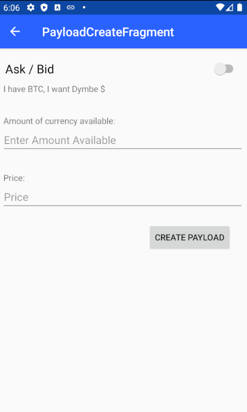

# Market bot

This app can generate bids and asks which are received by the peers in the market community.
The bid and asks can either be generated automatically or manually. Those bids and asks will be send as IPv8 messages.

## Sending

1. Automatically:
   Toggle the "Generate payloads" switch to send random bids and asks to the community.
   Those bids and asks can only be seen by other peers, as acting on your own offers is not possible.

2. Manually:
    Press the "New Payload" button.
    You will be guided to the next fragment where you can create a payload for either, a bid or ask from BTC to Dymbe Dollars.

## Buying

Upon clicking on an bid or ask offer, a proposal block is sent to do a transaction.
The receiving peer sends an agreement block (Signs block) to make the trade valid.

