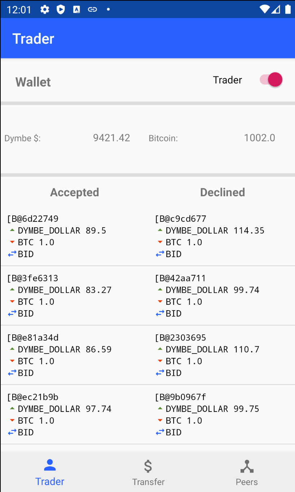
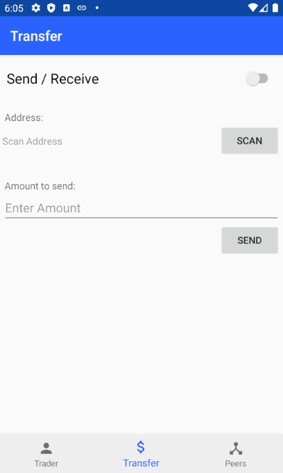
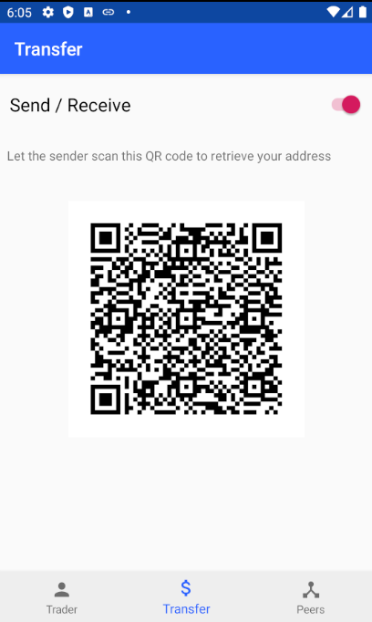
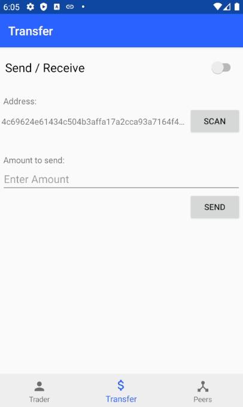
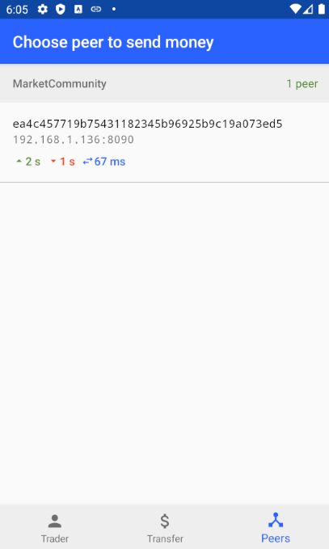

# AI trading bot

The AI trading bot app consist of two parts.
1. An AI trading bot using a Naive Bayes Classifier which buys or sells Bitcoins in a decentralized market.
2. Sending and receiving money to and from other peers.

## AI trading bot

The AI trading bot app is visible upon opening the superapp. It receives bids and asks from other peers which want to buy or sell Bitcoins for Dymbe Dollars.
Upon receiving a bid or ask, it decides to either act ont the offer or not.
The bot can be toggled on and off by using the toggle on the top right of the home screen.

### Bids/Asks
The bids and asks are received messages from other peers. For example, generated by the Trustchain Bid-ask generator app.
The app listens to one specific payload, but more types of payloads could be added, such as payloads for trading several currencies or other types of trading.
Upon receiving a bid or ask, the AI can send a proposal block to the sender of the message to make the trade. After the receiver sings this block, the transaction is validated and permanent.

### Naive Bayes Classifier
This naive implementation of a bayesian classifier is able to determine the mean and standard deviation of recent trades, and determines whether or not to fill a bid/ask order depending on how far away from the mean price the limit order is.

v0.1 implements a trained bot for the DD_BTC pairing, assuming a mean of 100DD per 1BTC. Features are described below.

#### Features

1. Columns:
    1. Price (DD_BTC pairing, integer values only)
    1. Buy/Sell (Binary, 0 for buy, 1 for sell)

1. Training data: 100,000 data points with 2 target labels
    * 0: Below mean
    * 1: Above mean

#### Training the model
Training data is in .csv format. Import the training data by creating a `NaiveBayes` object with the training data as argument. After creating an instance of the model, it is automatically trained for prediction.

#### Obtaining Predictions
Use `predict` in NaiveBayesClassifier to obtain a target label prediction. `predict` will choose the label with the highest probability.
Use `predictWithProbability` in NaiveBayesClassifier to obtain a target label prediction and its associated probability.

### Wallet
After the AI algorithm has decided to either buy or sell, it virtually trades the coins and updates its wallet.
By default, it does not try to execute the transaction, since it does not send a proposal block upon accepting an offer
In order to switch this on, look at the comments in TraderFragment.accept().

## Sending and receiving money to and from other peers.
In the sending/receiving money tab one can send money to a different peer, or receive money from a different peer.
There are two ways to find a public key:
1. The receiving peer presses the send/receive toggle. His public key will be shown as a QR-code. Now pressing the "scan" button on the sender's device allows you can scan the QR code of the receiver.
2. As a sender, go to the "Peers" fragment in the app, and press the public key of the receiver.

The public key is now filled in the Transfer fragment. Now you can enter an amount and send the money.
The receiving peer will receive a proposal block in its chain. 
 
Your public key in QR-code:  
 
After scanning QR code of other peer: 
 
Or choose a peer from the community:  

