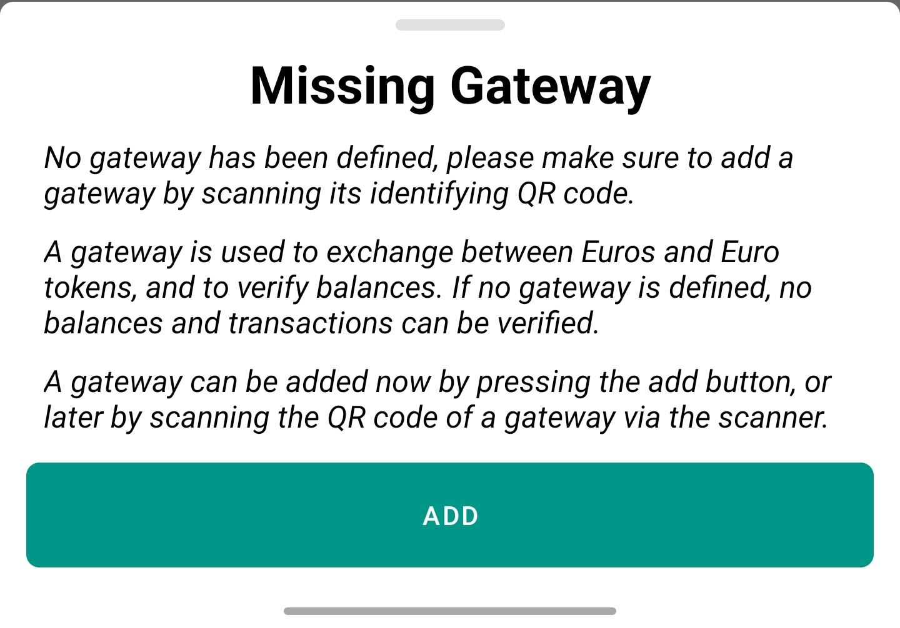
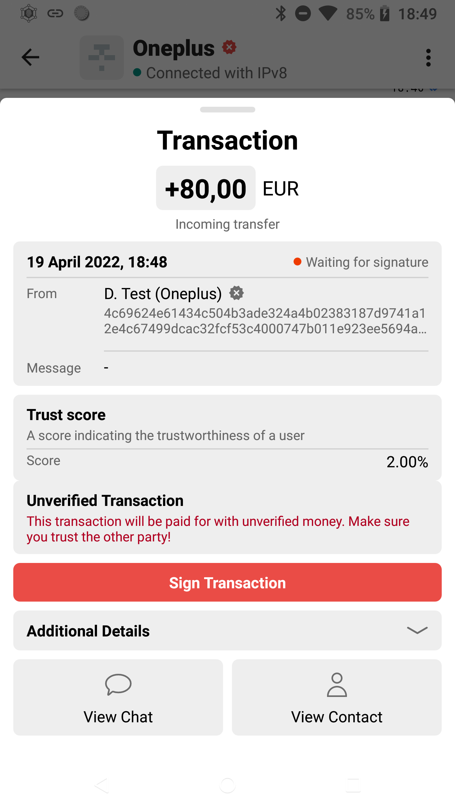
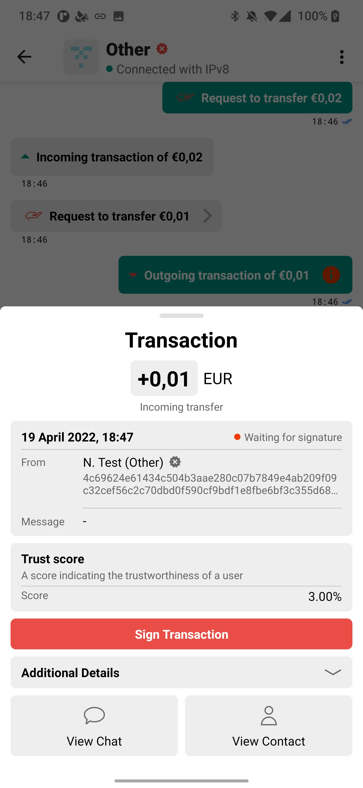
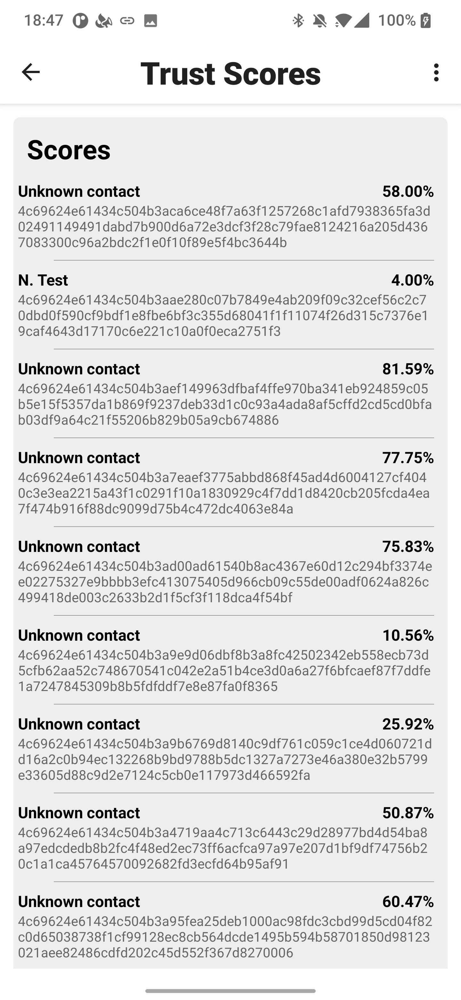

# Value transfer (ConfIDapp)

ConfIDapp is an application where multiple functionalities are combined.
It uses the EuroToken repository to create token and transfer money to other users.
It uses PeerChat to have an integrated chat, where tokens can also be used.
ConfIDapp also provides integration with legal documents such as an ID or passport.

## EuroToken
ConfIDapp provides some additional functionality over the existing EuroToken repository: enhanced gateway options, unverified transfer, and web of trust.

### Gateways
In ConfIDapp, there is now an additional warning when no gateway is configured, indicating to the user what this means.

Additionally there is now an option to add a gateway by scanning a gateway information code.
This does no longer require the user to make a transaction with this gateway.
The updated gateway can be found [here](https://github.com/leondeklerk/stablecoin-exchange), along with instructions.

### Unverified transfers
In addition to transfer with verified balance, there is the option to pay with unverified balance.
Unverified balance can be useful in an offline scenario where for longer periods of time no money can be verified by the validators.
Unverified money is handled by a switch on the request money screen, and propagated by the `KEY_UNVERIFIED` field in blocks.
When a user has to pay, unverified money is allowed, there is insufficient verified balance, but enough unverified balance, the unverified balance is used.
This is displayed to the receiver by a warning on the transaction screen, before signing the transaction.

### Web of trust
To improve the security of verified and unverified transfers there is a basic implementation of a web of trust.
This aims to provide users with a better indicating of the trustworthiness of the other party.
Before signing a transaction the users is shown a trust score of the other party, and can make a decision based on this.

All scores are stored and retrieved locally.
Upon completing a transaction, the receiver of the funds will increase the trust score of the sender with 1%.
Upon completing a transaction, the sender of the funds, will send up to N (currently 10) of its own known scores together with the public key.
To send these scores the EVA protocol is used together with kotlin serialization.
When these scores are received, the receiver will add these to the list of received scores for this public key, together with the score of the sender.
Then a new score is calculated based on the weighted average of the current known score (weighted by a 100% as its the score we already had ourselves), and the received scores weighted by the scores of their senders.

There is also a screen where all current scores can be found, as well as two debug menu options to insert 10 random new scores or clear all scores.

